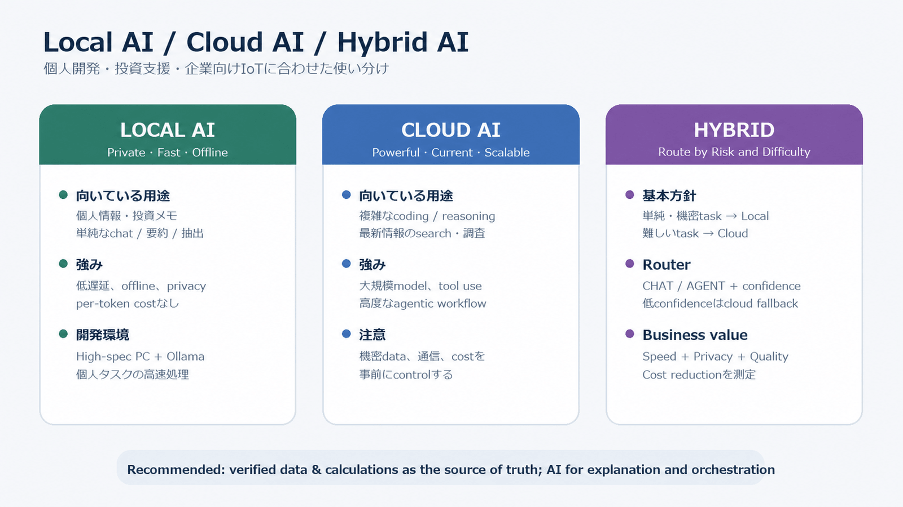

# ｜2026年8月19日（水）ローカルAI・クラウドAIとAI駆動開発

> **Session 6 / Recorded session window:** 09:02–10:00 JST
> **主な話題:** Local AI / Cloud AI / Hybrid AI、Foundry Local、AI投資支援アプリ、企業向けIoT、AI駆動開発
> **評価上の注意:** 本レポートは文字起こしを根拠とする。Pronunciation、WPM、1秒超のポーズは直接計測していないため評価しない。共通60秒課題は未実施のため、新しい定量スコアは作成しない。

## 今日の要点 / Today at a Glance

Yukiは、ローカルAIとクラウドAIの使い分けについて、個人開発と業務の両面から詳しく議論した。自宅にはLLM実行用に構築した高性能PCがあり、個人データや単純な処理にはローカルAI、複雑なコーディング・高度なreasoning・最新情報の検索にはクラウドAIが適しているという結論に至った。

個人開発では、企業分析、銘柄スクリーニング、ポートフォリオ管理、投資判断支援を扱う投資支援アプリを開発している。Ollamaは通常のチャットには十分だが、LangGraphを使ったagentic workflowでは、入力を通常チャットとエージェントタスクに振り分ける最初のrouting判断が不安定になる場合があると説明した。

業務面では、勤務先のソフトウェア開発部門で、企業向けIoTプラットフォームの開発・テストに関わっていることを共有した。AIの対象をテスト工程だけに限定せず、要件・設計・実装・レビュー・テスト・リリース・保守を含む開発ライフサイクル全体へ広げたいという構想を説明した。組織へ提案する際の最優先の価値は、反復作業の削減と生産性向上による**コスト削減**である。

また、音声会話の実音声から発音を評価し、セッションレポートへ反映できる機能をOpenAI Supportへ要望として送信した。AI-assisted supportからは、現在のVoice Modeには音素精度、stress、intonation、linkingなどを実音声から直接採点する文書化された機能はない、という説明があった。要望は送信済みだが、製品チームによる検討や実装は約束されていない。

## 話題別メモ / Topic Notes

### 1. Local AI・Cloud AI・Hybrid AI

- Yukiの第一優先は**速度**。
- 自宅の高性能GPU・CPU搭載PCは、個人用途のローカルLLM実行に向いている。
- ローカルAIが向く用途:
  - 個人情報・投資メモ・機密データ
  - 単純なチャット、要約、抽出
  - オフライン処理、低遅延が必要な処理
- クラウドAIが向く用途:
  - 複雑なコーディング
  - 深いreasoningや複数段階の検証
  - 最新情報を使う検索・調査
  - 高性能モデルを必要とするagentic workflow
- 結論は、単純・機密タスクをローカル、難しいタスクをクラウドへ送る**hybrid architecture**。

### 2. Microsoft Foundry Local

Microsoftの公式記事を使い、Foundry Localの特徴を確認した。

- AIモデルをユーザーのデバイス上で実行できる。
- データをデバイス内へ保ち、オフラインでも利用できる。
- ネットワーク遅延とクラウドのper-token costを抑えられる。
- GPU、NPU、CPUを検出し、利用可能なhardware accelerationを自動選択する。
- ローカル用途向けに最適化されたモデルカタログとOpenAI-compatible APIを提供する。

**Source:** [Microsoft Learn — What is Foundry Local?](https://learn.microsoft.com/en-us/azure/foundry-local/what-is-foundry-local)

### 3. 投資支援アプリとAgent Routing

Yukiの投資支援アプリは、企業分析、銘柄スクリーニング、ポートフォリオ管理、投資判断支援を扱う。OllamaによるローカルLLMはチャット用途では十分だが、agentic taskか通常チャットかを判断するrouterの精度が安定しない場合がある。

今回整理した改善案:

1. RouterをLangGraphの最初に置く。
2. 出力を `CHAT` / `AGENT` とconfidenceに限定する。
3. 実際に誤分類した入力を保存し、few-shot examplesとevaluation setへ使う。
4. tool use、fresh data、複数action、外部状態の変更が必要ならagent候補とする。
5. confidenceが低い場合は、clarificationまたはcloud modelへrouting判断だけをfallbackする。
6. 数値、価格、財務比率は検証済みデータとdeterministic codeを正本にし、LLMは説明・比較・シナリオ整理を担当する。

### 4. 企業向けIoT・AI駆動開発

Yukiは勤務先のソフトウェア開発部門で、企業向けIoTプラットフォームの開発・テストに関わっている。AI initiativeはテスト自動化だけでなく、開発工程全体を対象とする。

想定できる支援領域:

- Requirements: 要件の分類、曖昧さ検出、traceability支援
- Design: 設計案の比較、interface・failure modeのレビュー
- Implementation: code generation、review、refactoring、documentation
- Testing: test-case generation、coverage分析、log analysis、defect triage
- Release / Operations: release note、incident summary、knowledge retrieval
- Management: 反復作業時間、lead time、defect数、rework costの可視化

提案時の第一のbusiness valueは**lower cost**。ただし、単なるAI導入数ではなく、削減時間、開発lead time、defect escape、rework、運用工数などで効果を測る必要がある。

### 5. Trustworthy AI / NIST AI RMF

投資支援アプリの信頼性を考えるため、NISTの英語記事を次の学習ソースとして選んだ。AIのrisk management、testing、monitoring、data qualityを、個人開発と業務の両方へ応用できる。

**Source:** [NIST — AI Risk Management Framework](https://www.nist.gov/itl/ai-risk-management-framework)

## 役立つ英語 / Useful English

### Natural / Conversational と Formal / Professional

| 目的 | Natural / Conversational | Formal / Professional | ポイント |
|---|---|---|---|
| 具体的に聞く | **Could you explain that more specifically?** | **Could you provide a more concrete example?** | 会話では `specifically` が自然。`concretely` は可能だが、より硬く抽象的に響く場合がある。 |
| PCの説明 | **I built a high-spec PC for running LLMs.** | **I built a high-performance workstation for local LLM inference.** | `high-end PC` も自然。 |
| Hybrid方針 | **For simple tasks, I’ll use local AI. For complex tasks, I’ll use cloud AI.** | **We use a hybrid architecture that routes workloads according to privacy, latency, and model-capability requirements.** | 会話では短い2文が明確。 |
| 業務の説明 | **I’m involved in developing an enterprise IoT platform.** | **I’m involved in the development and system-level testing of an enterprise IoT platform.** | `be involved in` は担当・関与を自然に表す。 |
| AI提案 | **I’m leading an initiative to integrate AI into our software-development process.** | **I’m proposing an organization-wide initiative to integrate AI across the software-development lifecycle.** | 日本語の「テーマ」は、この文脈では `theme` より `initiative` / `project` が自然。 |
| 効果 | **AI can make our work more efficient and effective.** | **The initiative aims to improve operational efficiency and development effectiveness.** | `efficient` は時間・労力、`effective` は成果。 |
| コスト | **Cost reduction is our top priority.** | **Cost reduction is our primary business objective because the department closely manages development expenditure.** | `be conscious of development costs` も自然。 |

### 今回の重要チャンク

- **My goal is to use AI across the entire development lifecycle—not just testing—to make our work more efficient and effective.**
- **Cost reduction is our top priority because our department is highly conscious of development costs.**
- **Ollama is sufficient for ordinary chat, but it is not yet reliable enough for complex agentic workflows.**
- **The routing works in some cases, but not in others.**
- **All of the above.**
- **Do you know what I’ve been working on recently?**

### Word choice: team と theme

- **team** /tiːm/: チーム、班
- **theme** /θiːm/: テーマ、主題
- 日本語の「業務テーマ」は、英語では文脈に応じて **initiative**, **project**, **focus**, **topic** が自然。

Practice:

> **Our team is working on an AI initiative for the entire development lifecycle.**

## Yukiの意見・結論 / Yuki’s Takeaways

1. 現状では、YukiにとってクラウドAIが複雑な仕事の第一選択である。
2. ローカルAIは速度、プライバシー、個人用途、単純タスクで価値がある。
3. 高性能PCがあっても、複雑なcoding、reasoning、search、agentic workflowではクラウドAIが優位。
4. 投資支援アプリでは、検証済みデータ・計算とLLMの説明能力を分離する必要がある。
5. 業務のAI initiativeはテストだけでなく、開発ライフサイクル全体を対象とする。
6. 組織への提案では、コスト削減を最初のbusiness caseにする。

## 今回の英会話評価 / English Performance

### Overall

**L3 / Mostly independent。Interaction & repairではL4相当の行動が明確に見られた。**

Yukiは、local/cloud AI、Ollama、LangGraph、agent routing、投資支援、IoT testing、AI-driven developmentという複雑な技術・業務テーマについて、自分の経験と判断を結び付けて会話を継続した。語を探すpauseやrestartは多かったが、意味がずれたときに自分から止めて説明し直し、会話の方向、訂正量、記事の選び方、レポート要件を明確に調整できた。

| Metric | Level | Evidence |
|---|---:|---|
| Task achievement | **L3** | 結論と理由を伝え、個人開発・業務の例を詳しく説明した。要点の英文化やまとめには支援を利用した。 |
| Fluency & coherence | **L3** | pause、filler、restartがあっても、技術的な説明を中断せず、意味のつながりを保った。 |
| Lexical resource | **L3** | Ollama、LangGraph、agentic task、integration test、system test、development lifecycleなど、必要な技術語彙を使用した。日常的な接続表現やregisterの選択では支援を利用した。 |
| Grammar control | **L3** | 語形、冠詞、前置詞、比較表現に誤りがあっても、ほとんどの場合は意味が明確だった。 |
| Interaction & repair | **L4** | 誤解を即座に修正し、`team/theme`、`reasoning/inference`、訂正量、話題変更、記事・レポート要件を自発的に調整した。 |
| Pronunciation | **N/A** | 信頼できる直接音声の分析・計測がないため評価しない。文字起こしから推定しない。 |

### Strengths

- 自分の個人開発と実務を、抽象的なAI議論へ具体的に結び付けた。
- 分からない語やニュアンスをその場で確認した。
- 意図と違う返答に対し、会話を止めて適切にrepairできた。
- AI initiativeの目的を、技術だけでなくcost reductionというbusiness valueへ結び付けた。

### Next Focus

- 最初に一文で結論を置き、その後に理由と具体例を一つずつ加える。
- 技術説明では、`Current state → Problem → Proposed approach → Expected benefit` の4段構成を使う。
- `efficient / efficiency / effective`、`specific / specifically / concrete` の品詞とregisterを使い分ける。
- 次回、AI initiativeについて共通60秒課題を実施し、`main point → reason → example → conclusion` を同条件で記録する。

## 学習バンク更新 / Study Banks Update

### Expression Bank — 新規追加候補

| Expression | Meaning / Usage / Example | Source |
|---|---|---|
| **My goal is to use AI across the entire development lifecycle—not just testing—to make our work more efficient and effective.** | AI initiativeのscopeと目的を一文で説明する。 | 2026-08-19 |
| **Cost reduction is our top priority because our department is highly conscious of development costs.** | 組織提案のbusiness rationaleを説明する。 | 2026-08-19 |

### Vocabulary Bank — 新規追加候補

| Word / IPA / POS | Meaning / Collocation / Example | Source |
|---|---|---|
| **initiative** /ɪˈnɪʃ.ə.t̬ɪv/ noun | **Meaning:** 組織的な新しい取り組み。 **Collocation:** launch / lead / propose an initiative. **Example:** I’m leading an initiative to integrate AI into our development process. | 2026-08-19 |
| **specifically** /spəˈsɪf.ɪ.kəl.i/ adverb | **Meaning:** 具体的に、特定して。日常会話では `concretely` より自然な場合が多い。 **Example:** Could you explain that more specifically? | 2026-08-19 |

### Pronunciation & Speaking Bank — 新規追加候補

| Word / Chunk | Speaking & Focus | Source |
|---|---|---|
| **team /tiːm/ vs theme /θiːm/** | `/t/` と `/θ/` の対比。 **Practice:** Our team is working on an AI theme. ※今回は発音を採点せず、練習チャンクとしてのみ登録する。 | 2026-08-19 |

## 次回 / Next Steps

1. AI initiativeを30秒で説明するprofessional pitchを作る。
2. その後、同じ内容を自然な会話表現へ言い換える。
3. 60秒課題: **How should an enterprise use AI across the development lifecycle while controlling cost and risk?**
4. 投資支援アプリのrouterについて、正分類例と誤分類例を各3件用意する。
5. NIST AI RMFから、investment-support appと企業向けIoTプラットフォームの両方に使えるrisk-control項目を選ぶ。

## Sources / References

- [Microsoft Learn — What is Foundry Local?](https://learn.microsoft.com/en-us/azure/foundry-local/what-is-foundry-local)
- [NIST — AI Risk Management Framework](https://www.nist.gov/itl/ai-risk-management-framework)

## Visual / Figure

*Figure: 個人開発と企業向けIoTの用途に合わせたLocal AI / Cloud AI / Hybrid AIの使い分け。会話内容と上記公式記事を基に作成。*
