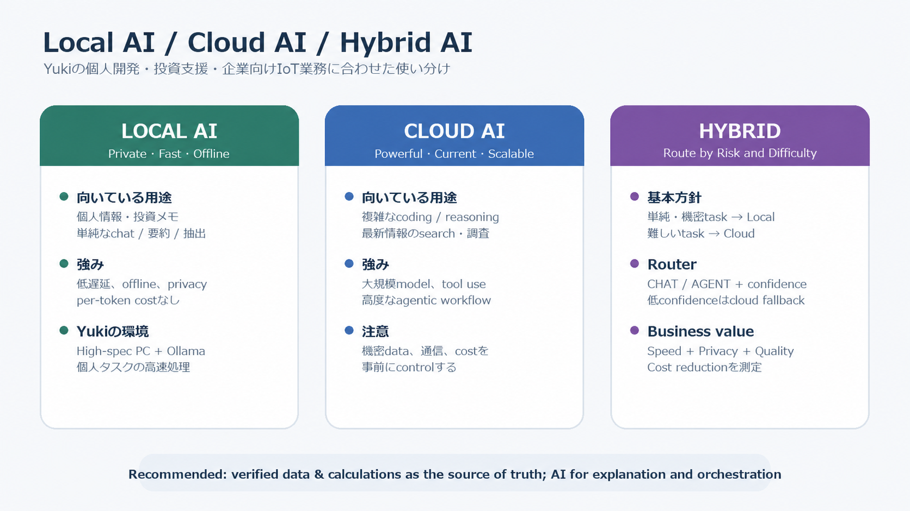
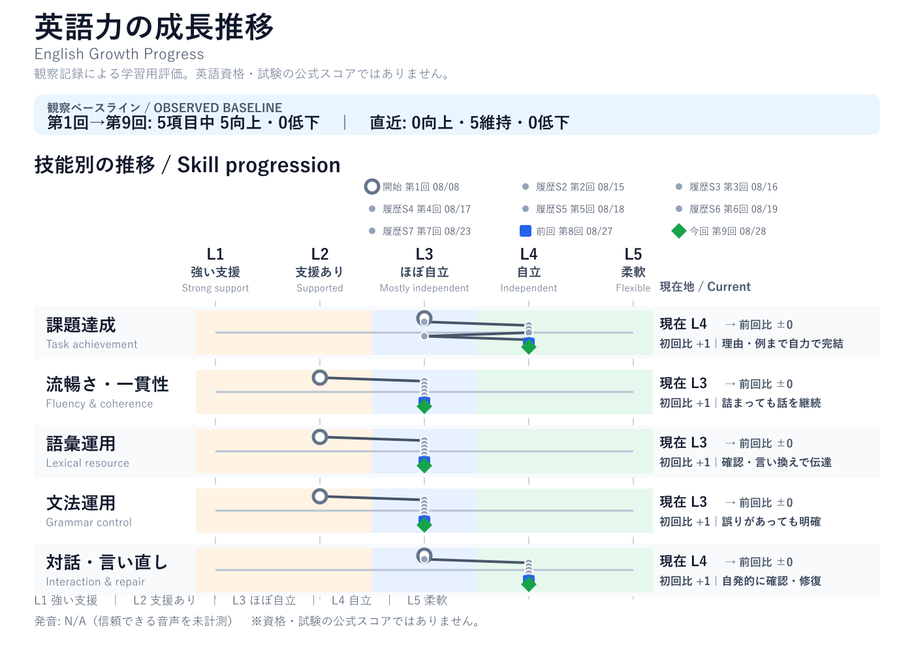
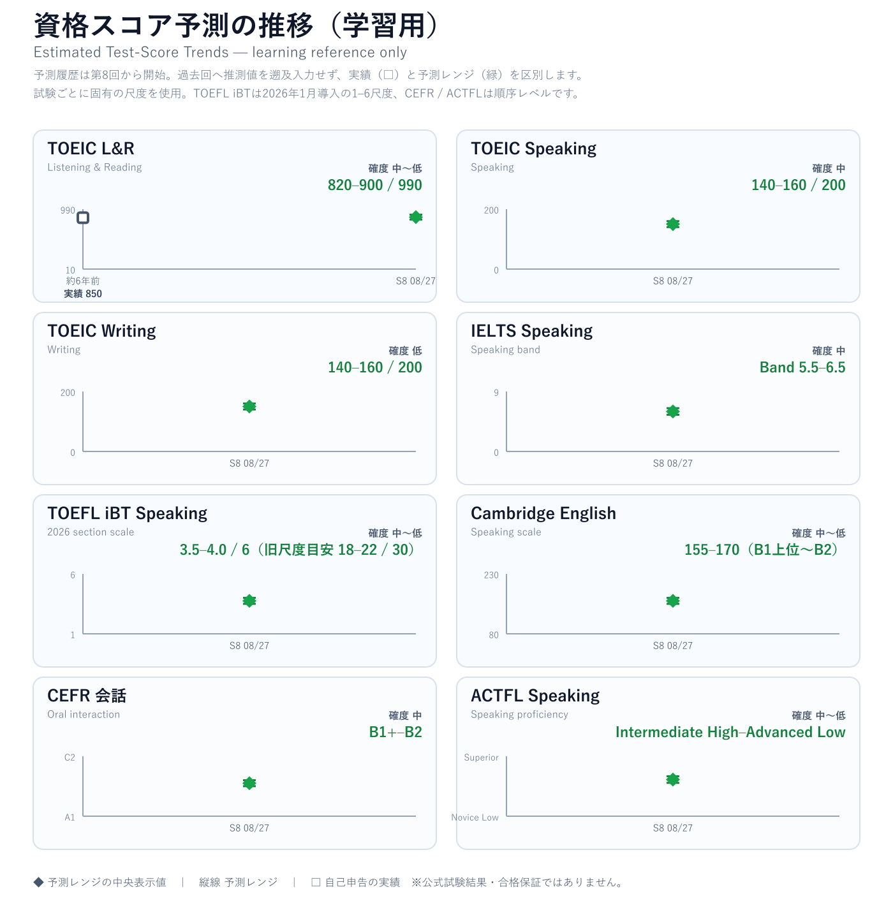

<!-- migration-meta: {"source":"Google Docs","document_id":"1IQcM5shAF13jvcNXRUZPpuv0CJ-PQI7cqhpuZQA0RHc","finalized_jst":"2026-08-31","coverage_through":"2026-08-28 / Session 9","anonymized_for_git":true} -->

> **Git管理用の匿名化済み移行スナップショット:** 2026年8月31日に完成確認したGoogle Docsを基に、固有の勤務先・所属・非公開製品・識別性の高い業務詳細を一般化した固定記録です。アクセス制御された原本の逐語コピーではありません。Session 9までの移行前履歴を照合するためだけに保持し、通常の更新は`learning-records/journal.md`へ反映します。

# **Daily English Learning Notes by Yuki × Chappy**

AI / Tech / English Conversation Journal

### **セッション目次 /** Session Index

8月 28, 2026 ｜ [Godzillaの象徴性と日常からの小さな逃避](#session-2026-08-28-01)

8月 27, 2026	[**｜	AIデータセンター・電力インフラ・マイクログリッド**](#｜2026年8月27日（木）aiデータセンター・電力インフラ・マイクログリッド)

8月 23, 2026[**｜エネルギー企業の戦略と先端エネルギー研究**](#｜2026年8月23日（日）エネルギー企業の戦略と先端エネルギー研究)

8月 19, 2026｜[ローカルAI・クラウドAIとAI駆動開発](#｜2026年8月19日（水）ローカルai・クラウドaiとai駆動開発)

8月 18, 2026[**｜面接当日のリセット：気持ちを整える英会話**](#2026年8月18日（火）面接当日のリセット：気持ちを整える英会話)

8月 17, 2026[｜AI・データセンターとエネルギー企業：英語で伝える技術・キャリア](#8月-17,-2026｜ai・データセンターとエネルギー企業：英語で伝える技術・キャリア)

8月 16, 2026[**｜エネルギー企業の面接準備：強みの言語化と英語面接フレーズ**](#8月-16,-2026｜エネルギー企業の面接準備：強みの言語化と英語面接フレーズ)

8月 15, 2026[**｜GPT-5.6 on Amazon Bedrock：モデル選択とPrompt Caching**](#8月-15,-2026｜gpt-5.6-on-amazon-bedrock：モデル選択とprompt-caching)

8月 8, 2026[**｜韓国旅行と英会話リハビリ：伝わる英語から自然な英語へ**](#2026-08-08｜韓国旅行と英会話リハビリ：伝わる英語から自然な英語へ)

### **学習バンク /** Study Banks

* [**表現バンク /** Expression Bank](#2.-表現バンク-/-expression-bank)
* [**語彙バンク /** Vocabulary Bank](#3.-語彙バンク-/-vocabulary-bank)
* [**発音バンク /** Pronunciation & Speaking](#4.-発音バンク-/-pronunciation-&-speaking)

### **学習管理 /** Learning Tools

* [**運用ルール /** Operating Rules](#学習記録の運用ルール-/-learning-log-rules)
* [**英語力評価 /** English Growth](#英語力の成長評価-/-english-growth-&-evaluation)

# **1\. 英会話セッション /** Daily Notes

会話の完全版ログ。話した内容・英語改善・語彙・発音・URL・画像をトピックの文脈の中にまとめる。

## **｜2026年8月28日（金）Godzillaの象徴性と日常からの小さな逃避**

## Session 9 / Realtime conversation; no direct pronunciation recording

### **今日の要点 / Today at a Glance**

## ホテルで日常のループから少し離れてrelaxする話から始め、Godzillaを核不安・戦争・戦後日本の記憶を象徴する存在として議論した。Yukiは、子どもの頃はmonster battlesに惹かれ、今はspectacleと歴史的なsymbolismの両方に魅力を感じると説明した。

### **話題別メモ / Topic Notes**

## **1\. 日常からの小さな逃避** ホテルで過ごす時間を、通勤と帰宅の繰り返しから離れる小さなresetとして話した。カジュアルな会話では *vibe* が自然で、*The hotel has a calm, relaxing vibe.* と表現できる。

## **2\. Godzilla：symbolismとspectacle** 1954年のGodzillaはnuclear fearとpostwar memoryを強く象徴する。一方、後の作品ではmonster battlesのspectacleも大きな魅力になった。両者は対立するのではなく、娯楽性の下に歴史的な重さが残る点がGodzillaの深さにつながっている。

## **3\. Yukiの見方の変化** 子どもの頃はmonster battlesが一番の魅力だったが、今はGodzillaの歴史、nuclear symbolism、warの記憶まで考えられるようになった。Yukiの結論は、symbolismとspectacleの両方がGodzillaを魅力的にしている、というものだった。

### **役立つ英語 / Useful English**

| 目的 | Natural / Conversational | Formal / Professional | ポイント |
| ----- | ----- | ----- | ----- |
| **日常から離れる** | We want to get away from our usual routine. | We would like a brief break from our usual routine. | get away from ... は会話で自然。 |
| **雰囲気を言う** | The hotel has a calm, relaxing vibe. | The hotel offers a calm and relaxing atmosphere. | vibeはカジュアル、atmosphereは中立的。 |
| **象徴性を説明する** | Godzilla symbolizes nuclear fear. | Godzilla functions as a symbol of nuclear anxiety and postwar trauma. | is a conceptよりsymbolizesが自然。 |

### **英語の改善 / Key Refinements**

## **Yuki's English:** I go company every day. I'm tired of that. **Natural:** I go to work and come home every day. I'm tired of the same routine. **Why:** companyではなく *go to work*。繰り返しへの疲れは *the same routine* が自然。

## **Yuki's English:** Godzilla is concept of nuclear. **Natural:** Godzilla symbolizes nuclear fear. **Why:** 「〜を象徴する」は *symbolize* を動詞で使う。

## **Yuki's English:** It's one of the attractive points of Godzilla. **Native-ish:** That's one of the things that makes Godzilla so appealing. **Why:** attractive pointより *part of the appeal* / *makes ... appealing* が会話らしい。

### **語彙 / Vocabulary**

## **vibe** /vaɪb/ \[noun, informal\]：雰囲気。*a calm vibe / a modern vibe* **sleek** /sliːk/ \[adjective\]：すっきりした、洗練された。*a sleek hotel / sleek design* **symbolize** /ˈsɪm.bə.laɪz/ \[verb\]：〜を象徴する。*symbolize nuclear fear* **spectacle** /ˈspek.tə.kəl/ \[noun\]：目を引く壮大な見せ場。*visual spectacle / monster-battle spectacle*

### **発音・スピーキング / Speaking & Pronunciation**

## Pronunciation: N/A / 直接音声を分析していないため、発音・WPM・ポーズは評価しない。 Practice chunks: “a CALM, reLAXing VIBE” / “GodZILLa SYMbolizes NUclear FEAR.” Focus: 内容語を強くし、短い意味チャンクとして話す。これは練習項目であり、発音評価ではない。

### **英語力の成長メモ / English Growth Snapshot**

## Task achievement L4：子どもの頃と現在の見方を比較し、結論・理由・例をつないだ。 Fluency & coherence L3：言い直しがあっても主題を維持し、対話を続けた。 Lexical resource L3：vibe、symbol、spectacle、nuclear fearを意味確認後に議論へ使った。 Grammar control L3：時制と語順に改善余地はあるが、意図は明確に伝えた。 Interaction & repair L4：意味や質問の意図を自分から確認し、話題の進行を調整した。 Pronunciation：N/A / 直接音声の評価録音なし。共通60秒課題がないため、数値的な前回比は作らない。

### **出典 / Source**

## [National WWII Museum — Godzilla and World War II: Long Live the King of Monsters](https://www.nationalww2museum.org/war/articles/godzilla-and-world-war-ii-long-live-king-monsters)：Castle Bravo、第五福竜丸、戦後日本とGodzilla誕生の関係を確認した。

### **次回 / Next Steps**

## 60秒で説明する：*Why does Godzilla remain meaningful beyond monster battles?* Structure: Main point → reason → example → conclusion.

## **｜2026年8月27日（木）AIデータセンター・電力インフラ・マイクログリッド**

Session 8 / Direct reading recording included

## 今日の要点 / Today at a Glance

AIデータセンターの急速な拡大で電力需要が増える一方、送電線・変電所などの大規模な系統増強には長い時間がかかることを、公式記事とIEAの予測グラフを使って議論した。Yukiは、microgridを「データセンターの近くに置く小さな地域電力システム」として理解し、主系統が忙しい時間帯にbatteryやlocal generationで支える仕組みを整理した。

## 話題別メモ / Topic Notes

### 1\. AIデータセンターと電力需要

データセンターはserver、GPU、high-speed networking、cooling、power systemsから成る物理的な施設である。大規模AIは、学習時だけでなく、日々の推論でも多くのGPUと電力を必要とする。従来のsupercomputerが限られた研究用途だったのに対し、現在は多くのクラウドサービスとAI利用を支える多数のデータセンターが急速に増えている。

### 2\. Microgridが担う役割

microgridは、主系統への接続、local generation、battery storage、control softwareを組み合わせるローカル電力システムである。データセンターの早期接続、需要ピーク時の負荷抑制、停電時のcritical load維持に役立つ。ただし、送電線・変電所・発電設備の長期的な増強を置き換えるものではなく、移行期を支える補完策である。

### 3\. Yukiの見解：電化と一次エネルギー

Yukiは、電化が自動的に脱炭素を意味するわけではないと指摘した。fossil fuelsがprimary energy sourcesとして残り、electricity generationでcoalやnatural gasを使う地域では、変換時の熱損失も含めて考える必要がある。nuclear powerはlow-carbonで安定供給に寄与し得るが、安全性・廃棄物・コスト・社会的信頼の課題もあるという立場を示した。

## 役立つ英語 / Useful English

| 目的 | Natural / Conversational | Formal / Professional | ポイント |
| ----- | ----- | ----- | ----- |
| **意見を慎重に伝える** | I’m skeptical about the recent trend toward placing greater emphasis on electricity. | Greater electrification does not automatically reduce emissions when the generation mix remains fossil-fuel intensive. | electricityはprimary energyではなくenergy carrier。環境価値はgeneration mixとend-use efficiencyの両方で考える。 |

### Vocabulary

microgrid /ˈmaɪ.kroʊ.ɡrɪd/ (noun): a small local electricity system that can use the main grid, local generation, batteries, and controls.
primary energy /ˈpraɪ.mer.i ˈen.ɚ.dʒi/ (noun): energy available before conversion, such as coal, natural gas, wind, or nuclear fuel.
energy carrier /ˈen.ɚ.dʒi ˈker.i.ɚ/ (noun): a form that delivers energy, such as electricity or hydrogen.

## 発音・スピーキング / Speaking & Pronunciation

Direct audio evidence: 約59.8秒の英語音読を確認。48kHz monoで、near clippingは確認されず、全文が概ね安定して認識された。話速は約105語/分で、聞き手が追いやすい練習ペースだった。
Pronunciation evaluation: L3 / Mostly independent。全体の明瞭さは良好。次はcontent wordsを強く、function wordsを軽くして、stressとrhythmをさらに明確にする。これは標準化された音素採点ではなく、直接録音の明瞭さ・ペース・音声品質に基づく学習用評価である。
Practice chunks: “TECHnology can make EVeryday LIFE safer and more conVENient.” / “TRUST is just as imPORtant as innoVAtion.”

## Chappy’s Comment

今日の議論で特に良かったのは、記事の要約を受け取るだけでなく、「なぜ今データセンターの電力が問題なのか」「電化は本当に環境に良いのか」と前提まで掘り下げたこと。AI、系統、一次エネルギー、原子力を一つの視点で結び付けられた。次は、結論を最初に一文で置き、reasonとexampleを一つずつ加えると、技術的な意見がさらに説得力を増す。

## 英語力の成長メモ / English Growth Snapshot

Task achievement: L4。データセンター、GPU、supercomputer、microgrid、一次エネルギーをつなげ、自分の意見を理由付きで展開した。
Fluency & coherence: L3。語を探すpauseがあっても、質問で確認しながら論点を維持した。
Lexical resource: L3。microgrid、primary energy、energy carrier、generation mixなどを質問して理解し、議論に使った。
Grammar control: L3。意味は明確に保てた。主語・冠詞・単複を整えると、長い説明がより自然になる。
Interaction & repair: L4。分からない語、記事の難易度、説明の順番を自発的に調整し、意図と異なる理解もその場で修正した。
Pronunciation: L3。直接録音で全体の明瞭さと安定したペースを確認。次はstressとrhythmを重点的に練習する。

## 学習バンク更新 / Study Banks Update

Expression Bank: 3 Bank横断で重複を確認し、“I’m skeptical about the recent trend toward placing greater emphasis on electricity.” を先頭へ追加済み。
Vocabulary Bank: 3 Bank横断で重複を確認し、microgrid / primary energy / energy carrier を先頭へ追加済み。
Pronunciation & Speaking Bank: 直接音声の根拠に基づき、content wordsのstressとfunction wordsのweak formsを練習する2つのchunksを先頭へ追加済み。

## 次回 / Next Steps

60秒で説明する: “Why are AI data centers becoming an energy-infrastructure issue, and what can microgrids do?”
Structure: Main point → reason → example → conclusion。

## Sources / References

[U.S. Department of Energy — “Microgrids, Large Electric Loads & Grid Support”](https://www.energy.gov/oe/articles/microgrids-large-electric-loads-grid-support-how-leverage-microgrids-support-utilities)
[International Energy Agency — “Electricity 2026: Demand”](https://www.iea.org/reports/electricity-2026/demand)

[*図1 / Figure 1: マイクログリッドによるデータセンター支援（U.S. Department of Energy, Office of Electricity 公式記事画像）*](https://www.energy.gov/oe/articles/microgrids-large-electric-loads-grid-support-how-leverage-microgrids-support-utilities)

*利用条件: DOE公式サイトのコンテンツは、別記がない限りパブリックドメインとする[公式再利用方針](https://www.energy.gov/cmei/systems/awardee-communications-support#reposting-and-remixing-content)を参照。新しい学習画面では自作概念図を使用する。*

*図2 / Figure 2: 米国の用途別電力需要増加、2015–2030。出典: [IEA (2026), Electricity 2026 — Demand](https://www.iea.org/reports/electricity-2026/demand), License: [CC BY 4.0](https://creativecommons.org/licenses/by/4.0/)。表示用にトリミングした派生画像。This is a work derived by Yuki × Chappy from IEA material and Yuki × Chappy is solely liable and responsible for this derived work. The derived work is not endorsed by the IEA or its Member countries in any manner.*

## ｜2026年8月23日（日）エネルギー企業の戦略と先端エネルギー研究

Session 7 / Recorded session window: 06:54–07:34 JST
主な話題: 応募先のエネルギー企業の中期経営方針、電化と発電時CO2、エネルギー安定供給、大学の研究機関での先端エネルギー研究、キャリア動機
評価上の注意: 本レポートは文字起こしを根拠とする。Pronunciation、WPM、1秒超のポーズは直接計測していないため評価しない。共通60秒課題は未実施のため、新しい定量スコアは作成しない。

## 今日の要点 / Today at a Glance

Yukiは、応募先のエネルギー企業で次の選考段階へ進んだことを共有し、面接にも役立つ公開英語記事を音読・議論した。記事の中心である2050年カーボンニュートラル、持続可能な社会、stakeholdersについて、自分の意見を英語で展開した。
電化については、利用時に排出がなくても発電方法によってCO2が生じるため、「電化＝自動的な脱炭素」ではないと指摘した。そのうえで、安定供給と脱炭素を同時に進める必要があるという結論に至った。
後半では、大学の研究機関で取り組んだ先端エネルギー研究を説明した。異なる時間スケールの現象を扱うシミュレーションを実験へ接続し、実験前の設計条件を検討した経験を、エネルギー分野で社会へ貢献したい動機へ結び付けた。

## 話題別メモ / Topic Notes

### **1\. エネルギー企業の方針とstakeholders**

公式のLong-Term Management Vision 2030 / Medium-Term Management Plan 2026を読み、2030年を2050年カーボンニュートラルへ向けた転換点と位置付けていることを確認した。Yukiは、政府が国の目標とエネルギー政策を定めるため、重要なstakeholderだと説明した。一方で、企業、顧客、地域社会、従業員、投資家を含むsociety as a wholeも影響を受けるという広い見方を示した。

### **2\. 電化は自動的な脱炭素ではない**

Yukiの中心的な問いは、電気を使う側がcleanでも、発電過程にCO2が残る場合、electrificationをどこまで推進すべきかという点だった。議論では、電気はenergy carrierであり、環境価値はgeneration mixと効率に左右されると整理した。EVやheat pumpなど適する用途の電化と、電源の脱炭素化、送電網・蓄電・安定供給を同時に進める必要がある。

### **3\. 先端エネルギー研究と複数スケールのシミュレーション**

研究経験の説明では、異なる時間スケールを扱う複数のsimulationを実験へ結び付け、実験前にmaterialやgeometryなどの設計条件を検討した流れを英語で伝えた。技術語が不足した場面でも、particle / fluid / material / shapeなど既知語で意味を維持し、必要な用語を質問して説明を完成させた。

### **4\. エネルギー分野へのキャリア動機**

Yukiは、エネルギーは社会全体を変え得る基盤であり、先端エネルギー技術が実用化されれば世界のエネルギー問題を大きく改善できると考えている。研究は長期的な可能性、応募先企業の事業は現在の安定供給と移行を担う実践領域であり、研究経験と現在のキャリア志向を一つの物語として説明できる。

## 役立つ英語 / Useful English

### **Natural / Conversational と Formal / Professional**

| 目的 | Natural / Conversational | Formal / Professional | ポイント |
| ----- | ----- | ----- | ----- |
| **選考通過** | They told me I had moved on to the next stage. | I was informed that I had progressed to the next stage of the selection process. | move on to the next stage が自然。 |
| **電化への懸念** | Electricity is only as clean as how it’s generated. | The environmental benefit of electrification depends on the power-generation mix. | 利用時だけでなく発電過程も見る。 |
| **研究分野** | My research focused on an advanced energy technology. | I specialized in simulation and experimental design for advanced-energy research. | majorよりresearch focus / specializeが適切。 |
| **実験設計** | I ran simulations to choose the material and geometry. | I used coupled simulations to optimize the design conditions before the experiment. | 技術文脈の形状はgeometry。 |
| **両立** | We need both a stable energy supply and faster decarbonization. | Energy policy must balance security of supply with accelerated decarbonization. | both A and B / balance A with B。 |

## 発音・スピーキング / Speaking & Pronunciation

Pronunciation: N/A / 音声未計測。今回の記録は文字起こしのみを根拠とし、発音・stress・rhythm・linking・WPM・ポーズ時間を推定しない。音読中は遮らず、完了後に内容と再利用価値の高い語句だけを扱った。
会話の途中でYukiが「訂正が多すぎる」と明示したため、意味への反応を先にし、意味が明確な英語は過度に直さない運用ルールへ即座に戻した。これはInteraction & repairの重要な実例でもある。

## 英語力の成長メモ / English Growth Snapshot

Task achievement: L4。電化への疑問から先端エネルギー研究、社会的な動機まで、理由と具体例をつないで説明した。
Fluency & coherence: L3。pauseやrestartがあっても、専門的な説明の意味の流れを維持した。
Lexical resource: L3。advanced-energy research、particle / fluid simulation、material、geometryなどを使い、未知語は質問と既知語で補った。
Grammar control: L3。動詞形・冠詞・語順に誤りがあっても、ほとんどの意味は明確だった。
Interaction & repair: L4。記事の選択、Chromeでの表示、質問の意図、訂正量、レポート開始・停止を自発的に調整した。
Pronunciation: N/A / 音声未計測。

### **良かった点**

* 研究内容を、目的、複数スケールのシミュレーション、実験前の設計という順で詳しく説明できた。
* 電化の利点だけでなく、発電時CO2という前提を問い直し、議論を深めた。
* 過度な訂正に対して明確に希望を伝え、会話の自然さを回復した。

### **次に伸ばす点**

* 専門説明では、Purpose → Method → Result / Impact の3段構成を先に置く。
* energy carrier、generation mix、commercially viableなど、エネルギー議論の核語彙を再利用する。
* 面接では、先端エネルギー研究の長期視点と、現在のエネルギー事業で実現したい価値を一文で接続する。

## 学習バンク更新 / Study Banks Update

Expression Bank: 「Electricity is only as clean as how it’s generated.」を追加。
Vocabulary Bank: electrification を追加し、energy carrier / generation mixとの使い分けを記録。
Pronunciation & Speaking Bank: 該当なし。直接音声を計測しておらず、独自の発音課題を確認できないため追加しない。

## 次回 / Next Steps

* 先端エネルギー研究を60秒で説明する: Purpose → Method → Result / Impact。
* 面接用に「研究経験 → エネルギーへの問題意識 → 応募先企業での実践的貢献」を短い英語でつなぐ。
* 次回の共通課題候補: How should an energy company balance electrification, energy security, and decarbonization?

## Sources / References

* 応募先企業の公開英語資料（組織名とURLは匿名化）
* [METI — Green Growth Strategy Through Achieving Carbon Neutrality in 2050](https://www.meti.go.jp/english/policy/energy_environment/global_warming/ggs2050/index.html)
* 大学研究機関の公開資料（所属名とURLは匿名化）

## **｜2026年8月19日（水）ローカルAI・クラウドAIとAI駆動開発**

Session 6 / Recorded session window: 09:02–10:00 JST
 主な話題: Local AI / Cloud AI / Hybrid AI、Foundry Local、AI投資支援アプリ、勤務先・企業向けIoTサービス、AI駆動開発
 評価上の注意: 本レポートは文字起こしを根拠とする。Pronunciation、WPM、1秒超のポーズは直接計測していないため評価しない。共通60秒課題は未実施のため、新しい定量スコアは作成しない。

## 今日の要点 / Today at a Glance

Yukiは、ローカルAIとクラウドAIの使い分けについて、個人開発と業務の両面から詳しく議論した。自宅にはLLM実行用に構築した高性能PCがあり、個人データや単純な処理にはローカルAI、複雑なコーディング・高度なreasoning・最新情報の検索にはクラウドAIが適しているという結論に至った。
個人開発では、企業分析、銘柄スクリーニング、ポートフォリオ管理、投資判断支援を扱う投資支援アプリを開発している。Ollamaは通常のチャットには十分だが、LangGraphを使ったagentic workflowでは、入力を通常チャットとエージェントタスクに振り分ける最初のrouting判断が不安定になる場合があると説明した。
業務面では、勤務先のIT開発部門で、企業向けIoTサービスに関連するシステム開発、結合テスト、システムテストに関わっていることを共有した。AIの対象をテスト工程だけに限定せず、要件・設計・実装・レビュー・テスト・リリース・保守を含む開発ライフサイクル全体へ広げたいという構想を説明した。組織へ提案する際の最優先の価値は、反復作業の削減と生産性向上によるコスト削減である。
また、音声会話の実音声から発音を評価し、セッションレポートへ反映できる機能をOpenAI Supportへ要望として送信した。AI-assisted supportからは、現在のVoice Modeには音素精度、stress、intonation、linkingなどを実音声から直接採点する文書化された機能はない、という説明があった。要望は送信済みだが、製品チームによる検討や実装は約束されていない。

## 話題別メモ / Topic Notes

### **1\. Local AI・Cloud AI・Hybrid AI**

* Yukiの第一優先は速度。
* 自宅の高性能GPU・CPU搭載PCは、個人用途のローカルLLM実行に向いている。
* ローカルAIが向く用途:
  * 個人情報・投資メモ・機密データ
  * 単純なチャット、要約、抽出
  * オフライン処理、低遅延が必要な処理
* クラウドAIが向く用途:
  * 複雑なコーディング
  * 深いreasoningや複数段階の検証
  * 最新情報を使う検索・調査
  * 高性能モデルを必要とするagentic workflow
* 結論は、単純・機密タスクをローカル、難しいタスクをクラウドへ送るhybrid architecture。

### **2\. Microsoft Foundry Local**

Microsoftの公式記事を使い、Foundry Localの特徴を確認した。

* AIモデルをユーザーのデバイス上で実行できる。
* データをデバイス内へ保ち、オフラインでも利用できる。
* ネットワーク遅延とクラウドのper-token costを抑えられる。
* GPU、NPU、CPUを検出し、利用可能なhardware accelerationを自動選択する。
* ローカル用途向けに最適化されたモデルカタログとOpenAI-compatible APIを提供する。

Source: [Microsoft Learn — What is Foundry Local?](https://learn.microsoft.com/en-us/azure/foundry-local/what-is-foundry-local)

### **3\. 投資支援アプリとAgent Routing**

Yukiの投資支援アプリは、企業分析、銘柄スクリーニング、ポートフォリオ管理、投資判断支援を扱う。OllamaによるローカルLLMはチャット用途では十分だが、agentic taskか通常チャットかを判断するrouterの精度が安定しない場合がある。
今回整理した改善案:

1. RouterをLangGraphの最初に置く。
2. 出力を CHAT / AGENT とconfidenceに限定する。
3. 実際に誤分類した入力を保存し、few-shot examplesとevaluation setへ使う。
4. tool use、fresh data、複数action、外部状態の変更が必要ならagent候補とする。
5. confidenceが低い場合は、clarificationまたはcloud modelへrouting判断だけをfallbackする。
6. 数値、価格、財務比率は検証済みデータとdeterministic codeを正本にし、LLMは説明・比較・シナリオ整理を担当する。

### **4\. 勤務先・企業向けIoTサービス・AI駆動開発**

Yukiは勤務先のIT開発部門で、企業向けIoTサービスの結合テスト・システムテストに関わっている。AI initiativeはテスト自動化だけでなく、開発工程全体を対象とする。
想定できる支援領域:

* Requirements: 要件の分類、曖昧さ検出、traceability支援
* Design: 設計案の比較、interface・failure modeのレビュー
* Implementation: code generation、review、refactoring、documentation
* Testing: test-case generation、coverage分析、log analysis、defect triage
* Release / Operations: release note、incident summary、knowledge retrieval
* Management: 反復作業時間、lead time、defect数、rework costの可視化

提案時の第一のbusiness valueはlower cost。ただし、単なるAI導入数ではなく、削減時間、開発lead time、defect escape、rework、運用工数などで効果を測る必要がある。

### **5\. Trustworthy AI / NIST AI RMF**

投資支援アプリの信頼性を考えるため、NISTの英語記事を次の学習ソースとして選んだ。AIのrisk management、testing、monitoring、data qualityを、個人開発と業務の両方へ応用できる。
Source: [NIST — AI Risk Management Framework](https://www.nist.gov/itl/ai-risk-management-framework)

## 役立つ英語 / Useful English

### **Natural / Conversational と Formal / Professional**

| 目的 | Natural / Conversational | Formal / Professional | ポイント |
| ----- | ----- | ----- | ----- |
| **具体的に聞く** | Could you explain that more specifically? | Could you provide a more concrete example? | 会話では specifically が自然。concretely は可能だが、より硬く抽象的に響く場合がある。 |
| **PCの説明** | I built a high-spec PC for running LLMs. | I built a high-performance workstation for local LLM inference. | high-end PC も自然。 |
| **Hybrid方針** | For simple tasks, I’ll use local AI. For complex tasks, I’ll use cloud AI. | We use a hybrid architecture that routes workloads according to privacy, latency, and model-capability requirements. | 会話では短い2文が明確。 |
| **業務の説明** | I’m involved in enterprise IoT system development. | I’m involved in the development and system-level testing of an enterprise IoT service. | be involved in は担当・関与を自然に表す。 |
| **AI提案** | I’m leading an initiative to integrate AI into our software-development process. | I’m proposing an organization-wide initiative to integrate AI across the software-development lifecycle. | 日本語の「テーマ」は、この文脈では theme より initiative / project が自然。 |
| **効果** | AI can make our work more efficient and effective. | The initiative aims to improve operational efficiency and development effectiveness. | efficient は時間・労力、effective は成果。 |
| **コスト** | Cost reduction is our top priority. | Cost reduction is our primary business objective because the department closely manages development expenditure. | be conscious of development costs も自然。 |

### **今回の重要チャンク**

* My goal is to use AI across the entire development lifecycle—not just testing—to make our work more efficient and effective.
* Cost reduction is our top priority because our department is highly conscious of development costs.
* Ollama is sufficient for ordinary chat, but it is not yet reliable enough for complex agentic workflows.
* The routing works in some cases, but not in others.
* All of the above.
* Do you know what I’ve been working on recently?

### **Word choice: team と theme**

* team /tiːm/: チーム、班
* theme /θiːm/: テーマ、主題
* 日本語の「業務テーマ」は、英語では文脈に応じて initiative, project, focus, topic が自然。

Practice:
Our team is working on an AI initiative for the entire development lifecycle.

## **Yukiの意見・結論 / Yuki’s Takeaways**

1. 現状では、YukiにとってクラウドAIが複雑な仕事の第一選択である。
2. ローカルAIは速度、プライバシー、個人用途、単純タスクで価値がある。
3. 高性能PCがあっても、複雑なcoding、reasoning、search、agentic workflowではクラウドAIが優位。
4. 投資支援アプリでは、検証済みデータ・計算とLLMの説明能力を分離する必要がある。
5. 業務のAI initiativeはテストだけでなく、開発ライフサイクル全体を対象とする。
6. 組織への提案では、コスト削減を最初のbusiness caseにする。

## **今回の英会話評価 / English Performance**

### **Overall**

L3 / Mostly independent。Interaction & repairではL4相当の行動が明確に見られた。
Yukiは、local/cloud AI、Ollama、LangGraph、agent routing、投資支援、IoT testing、AI-driven developmentという複雑な技術・業務テーマについて、自分の経験と判断を結び付けて会話を継続した。語を探すpauseやrestartは多かったが、意味がずれたときに自分から止めて説明し直し、会話の方向、訂正量、記事の選び方、レポート要件を明確に調整できた。

| Metric | Level | Evidence |
| ----- | ----: | ----- |
| Task achievement | **L3** | 結論と理由を伝え、個人開発・業務の例を詳しく説明した。要点の英文化やまとめには支援を利用した。 |
| Fluency & coherence | **L3** | pause、filler、restartがあっても、技術的な説明を中断せず、意味のつながりを保った。 |
| Lexical resource | **L3** | Ollama、LangGraph、agentic task、integration test、system test、development lifecycleなど、必要な技術語彙を使用した。日常的な接続表現やregisterの選択では支援を利用した。 |
| Grammar control | **L3** | 語形、冠詞、前置詞、比較表現に誤りがあっても、ほとんどの場合は意味が明確だった。 |
| Interaction & repair | L4 | 誤解を即座に修正し、`team/theme`、`reasoning/inference`、訂正量、話題変更、記事・レポート要件を自発的に調整した。 |
| Pronunciation | N/A | 信頼できる直接音声の分析・計測がないため評価しない。文字起こしから推定しない。 |

**Strengths**

* 自分の個人開発と実務を、抽象的なAI議論へ具体的に結び付けた。
* 分からない語やニュアンスをその場で確認した。
* 意図と違う返答に対し、会話を止めて適切にrepairできた。
* AI initiativeの目的を、技術だけでなくcost reductionというbusiness valueへ結び付けた。

### **Next Focus**

* 最初に一文で結論を置き、その後に理由と具体例を一つずつ加える。
* 技術説明では、Current state → Problem → Proposed approach → Expected benefit の4段構成を使う。
* efficient / efficiency / effective、specific / specifically / concrete の品詞とregisterを使い分ける。
* 次回、AI initiativeについて共通60秒課題を実施し、main point → reason → example → conclusion を同条件で記録する。

## 学習バンク更新 / Study Banks Update

### **Expression Bank — 追加**

| Expression | Meaning / Usage / Example | Source |
| ----- | ----- | ----- |
| **My goal is to use AI across the entire development lifecycle—not just testing—to make our work more efficient and effective.** | AI initiativeのscopeと目的を一文で説明する。 | Aug 19, 2026 |
| **Cost reduction is our top priority because our department is highly conscious of development costs.** | 組織提案のbusiness rationaleを説明する。 | Aug 19, 2026 |

### **Vocabulary Bank — 追加**

| Word / IPA / POS | Meaning / Collocation / Example | Source |
| ----- | ----- | ----- |
| **initiative** /ɪˈnɪʃ.ə.t̬ɪv/ noun | **Meaning:** 組織的な新しい取り組み。 **Collocation:** launch / lead / propose an initiative. **Example:** I’m leading an initiative to integrate AI into our development process. | Aug 19, 2026 |
| **specifically** /spəˈsɪf.ɪ.kəl.i/ adverb | **Meaning:** 具体的に、特定して。日常会話では `concretely` より自然な場合が多い。 **Example:** Could you explain that more specifically? | Aug 19, 2026 |

### Pronunciation & Speaking Bank — 追加

| Word / Chunk | Speaking & Focus | Source |
| ----- | ----- | ----- |
| team /tiːm/ vs theme /θiːm/ | `/t/` と `/θ/` の対比。 **Practice:** Our team is working on an AI theme. ※今回は発音を採点せず、練習チャンクとしてのみ登録する。 | Aug 19, 2026 |

## 次回 / Next Steps

1. AI initiativeを30秒で説明するprofessional pitchを作る。
2. その後、同じ内容を自然な会話表現へ言い換える。
3. 60秒課題: How should my employer use AI across the development lifecycle while controlling cost and risk?
4. 投資支援アプリのrouterについて、正分類例と誤分類例を各3件用意する。
5. NIST AI RMFから、investment-support appと企業向けIoTサービスの両方に使えるrisk-control項目を選ぶ。

## Sources / References

* [Microsoft Learn — What is Foundry Local?](https://learn.microsoft.com/en-us/azure/foundry-local/what-is-foundry-local)
* [NIST — AI Risk Management Framework](https://www.nist.gov/itl/ai-risk-management-framework)

## **Visual / Figure**

Local AI / Cloud AI / Hybrid AI comparison

## 2026年8月18日（火）面接当日のリセット：気持ちを整える英会話

## 今日の要点 / Today at a Glance

面接当日の朝、英語力向上を主目的にしながら、面接前の緊張を整えるための軽い会話を行った。Bon Odori、音楽、ミステリー小説、Dragon Questを題材に、自分の好みと「なぜリラックスできるか」を英語で説明した。

## 話題別メモ / Topic Notes

・面接後は妻とBon Odoriへ行き、food stallsの食事やfestive, lively atmosphereを楽しむ予定。集中しすぎた頭を、場所・音楽・人の雰囲気で切り替えるという自分の方法を説明した。
・休むときはrock music、ライブ会場のenergy、mystery novels、Dragon Questが好きだと話した。物語の状況が変化していくpage-turnerを「謎を自分で解くより、展開そのものを楽しむ」と説明できた。

## 役立つ英語 / Useful English

・gooey：とろっとして伸びる、濃厚な。例：I love gooey cheese.
・a twisty page-turner：意外な展開が続き、次のページを読みたくなる小説。
・a puzzle-solving mystery：手掛かりを追って謎解きを楽しむタイプのミステリー。

### 英語力評価 / English Performance

良かった点：面接前の気持ちや好みを、自分の理由と結び付けて説明できた。分からない語はそのまま止めずに意味を尋ね、意図が違うときは自分から修正して会話を続けられた。英語を日本語に訳さず理解する感覚を意識できていることも、実用的な聞く・話す力につながる前向きな変化。
次に伸ばす点：リラックス会話では正確さより流れを優先し、まず結論を一文で置く練習を続ける。たとえば「I like it because ...」の後に理由を一つだけ足すと、自然さを保ったまま話を少し長くできる。
評価上の注意：今回は共通60秒課題を行っていないため、新しい定量スコアは作らない。文字起こしだけでは発音を評価しないため、Pronunciation は N/A / 音声未計測 とする。

## 学習バンク更新 / Study Banks Update

Expression Bank：該当なし（自然な会話を優先し、既存表現との重複を増やさない）。
Vocabulary Bank：gooey を追加。新出の作品表現はDaily Noteに記録し、再使用の必要が出た段階で重複なくBank化する。
Pronunciation & Speaking Bank：該当なし（信頼できる音声評価を行えないため、発音項目は追加しない）。

## 次回 / Next Steps

・面接後の感想を、短く「気持ち → 理由 → 印象に残ったこと」の順で英語で話す。
・要復習語 concrete / deliverables を、仕事の例文で自然に1回ずつ使う。

## 8月 17, 2026｜AI・データセンターとエネルギー企業：英語で伝える技術・キャリア

## 今日の要点 / Today at a Glance

英語力向上を主目的に、IEAの記事を根拠にAIとデータセンターの電力需要を議論し、後半は応募先のエネルギー企業の面接に向けて技術経験・転職理由・国際業務への希望を英語で整理した。面接対策は会話題材として扱い、自分の考えを英語で説明し、分からない語を確認しながら言い直す力を重点的に練習した。

## 話題別メモ / Topic Notes

・IEAの記事では、データセンターの電力使用の中心はサーバー（平均約60%）。冷却の割合は、高効率なハイパースケール施設の約7%から、効率の低い企業内施設の30%超まで幅がある。割合の違いは絶対消費量の小ささを意味しない点も確認した。
・勤務先での企業向けIoT・ソフトウェア品質改善の経験を、応募職種の問い合わせ対応・エラー分析・運用改善と結び付けた。
・複数の外部エンジニアを調整する経験、テスト自動化、差分情報をAIへ渡して成果物を更新する構想を説明した。

### 明日の面接戦略 / Interview Strategy

1\. 最初に直接の適合を示す：システムテスト、エラー分析、運用保守、テスト自動化、ベンダーリード。
2\. 実績は一つの具体例で示す：E2Eテスト自動化を自ら構築し、プロセス改善と追加価値を生んだ。
3\. AI活用は補助的な強みとして話す：家庭用エネルギーマネジメントとの直接一致ではないが、課題発見・技術企画・継続改善の力を示す。
4\. 転職理由は前向きにする：経験と合う技術領域で貢献し、明確なキャリア形成と将来の国際的な仕事への道を求めていると説明する。現職への否定的な表現は避ける。
5\. 国際業務は中長期の希望として尋ねる：まず応募職種で専門性を築いて貢献する姿勢を先に伝える。

### 面接で使う核の英語 / Core Interview English

I coordinate an external engineering team on system-level quality work, and I’m also working to integrate AI into our development process to improve efficiency and quality.
Although this initiative is not directly related to residential energy management, it demonstrates my ability to identify process issues, design a technical solution, and lead continuous improvement.
I’m seeking a role that matches my technical experience and offers clearer career development, including opportunities to work internationally in the longer term.
First, I would like to build my expertise and contribute in this position. In the longer term, would there be opportunities to become involved in global projects or work with overseas teams?

### 英語力評価 / English Performance

良かった点：眠気がある中でも、AI・エネルギー・開発プロセス・キャリアという複雑な内容を、自分の言葉で長く説明できた。語が出ないときに言い換え、確認し、誤解を修正したため、Task achievement と Interaction & repair に明確な強みが見られた。 また、「英語を日本語へ訳さず、英語のまま理解できることが増えた」という自己認識は、今後の流暢さにつながる重要な定性的成長である。
今後伸ばす点：長い説明では語順・主語動詞・単複が不安定になりやすい。main point → reason → example → conclusion の4段構成で話すと、Fluency & coherence と Grammar control が安定する。
評価上の注意：本日は共通60秒課題を実施していないため、新しい定量スコアは作らない。発音は保存された音声を直接評価できないためN/Aとする。

### 要復習語 / Review Priority

concrete：具体的な。Example: I want to deliver concrete results.
tangible：実際に確認・実感できる。Example: The project produced tangible improvements.
deliverables：成果物。Example: AI can update deliverables such as specifications and test cases.
次回は日本語の意味を見ずに説明し、自分の仕事の例文で1回ずつ使う。

## 役立つ英語 / Useful English

auxiliary equipment（補助設備）／comprise（〜から成る）／colocation（共同設置型データセンター）／hyperscale（超大規模）／job posting（求人票）／be assigned to（〜に配属される）／express my wish（希望を伝える）／follow up with me（私に状況共有する）／follow through on a commitment（約束を実行する）

## 次回 / Next Steps

・面接直前は新しい情報を増やしすぎず、強み・転職理由・志望理由・逆質問を60〜90秒で確認する。
・次回の英会話では要復習語3語を自然な文脈で再確認する。
・英語力比較のため、次回は終了前に共通60秒課題を1回だけ行う。
・Source: [IEA — Energy demand from AI](https://www.iea.org/reports/energy-and-ai/energy-demand-from-ai)

## 8月 16, 2026｜エネルギー企業の面接準備：強みの言語化と英語面接フレーズ

### Today at a Glance

応募先のエネルギー企業における家庭向けエネルギーサービス関連の面接に向け、強み・志望理由・入社1年目の貢献を短く伝える準備をした。

### Interview Preparation

Yukiの一貫した強みは、技術・品質・現場をつなげて実際の改善につなげられること。大学院でのエネルギー研究、IoTシステム、E2E自動テスト基盤、品質・運用改善の経験を、家庭用エネルギーマネジメントへの貢献として説明する。

### Interview Message

「まずは業務と技術を早く理解し、品質・運用改善の経験を生かして、早期に具体的な成果を出したい。」
面接官に覚えてほしい核となるメッセージは、「技術と品質と現場をつなげて改善できる人」。

### Useful English

I’ve prepared a lot for the interview.
I put together an interview-prep document.
In my first year, I’ll focus on adapting quickly while delivering concrete results.
What do you think my chances are of getting an offer from the company?

### Speaking & Pronunciation

英語は十分に伝わり、発音も明瞭。今後は細かな訂正より、短い答えを落ち着いたペースで言い切ることを優先する。

### English Growth Snapshot

これまでの3回の会話を比べると、伝わりやすさ、話題を広げる力、英語で自分の意図を確認・調整する力が伸びている。今回は面接の3つの優先順位と1年目の貢献を、質問を重ねながら自分の言葉で組み立てられた。次は60秒の言い切り、冠詞・前置詞、意味チャンクでの発話を重点にする。

### Next Steps

面接前に「志望理由」「入社1年目の貢献」「応募先企業で実現したいこと」を各60秒程度で声に出して練習する。

## 8月 15, 2026｜[GPT-5.6 on Amazon Bedrock：モデル選択とPrompt Caching](#8月-15,-2026｜gpt-5.6-on-amazon-bedrock：モデル選択とprompt-caching)

### ✨ Today at a Glance

| Focus | Session Snapshot |
| :---: | ----- |
| **Baseball & recovery** | 野球練習、カフェ、昼寝を通じて「良い疲れ」とリラックスした一日を英語で表現。 |
| **AWS / AI** | Amazon Bedrock上のGPT-5.6 Sol・Terra・Lunaとexplicit prompt cachingを公式記事で学習。 |
| **English development** | 技術記事の長文音読に取り組み、会話のflowを守る新しいフィードバック順序を決定。 |

### ⚾ Baseball Practice, Café & Recovery

今日は野球練習に参加し、練習後はかなり疲れたものの「悪い疲れではなく、良い感じの疲労」だった。カフェではegg and bacon toast、cheese and bacon croissant、blend coffeeを楽しみ、帰宅後に昼寝をしてかなり回復した。

Yuki: “Today, I went baseball practices.”
Natural: “I had baseball practice today.” / “I went to baseball practice today.”
Why: practiceはこの文脈では不可算的に使い、go to / have baseball practiceをひとまとまりで覚える。

Yuki: “I get good exhausted.”
Natural: “I was tired in a good way.”
Native-ish: “It was a good kind of tired.” / “I felt pleasantly tired.”
Why: exhaustedは「かなり消耗した」という強い語。心地よい疲労にはtired in a good wayが自然。

Yuki: “I ate breads.”
Natural: “I had some bread.” / “I had a croissant.”
Why: breadは通常不可算名詞。カフェで食べたものを話すときはI had ... が会話的。

Yuki: “I was back home and I took nap.”
Natural: “I got home and took a nap.”
Why: take a napには冠詞aが必要。移動して帰宅したことはgot homeが自然。

### ☁️ AWS / AI Discussion: GPT-5.6 on Amazon Bedrock

AWS公式情報で、OpenAI GPT-5.6 Sol・Terra・LunaがAmazon Bedrockで一般提供されていることを確認した。GA announcement:
7月 13, 2026。3モデルはOpenAI Responses API互換のbedrock-mantle endpointから利用でき、料金はpay-per-token、利用量は既存のAWS commitmentsにも算入される。
[Source: AWS official launch announcement](https://aws.amazon.com/about-aws/whats-new/2026/07/openai-gpt-sol-terra/)

### Explicit prompt caching

explicitは「明確に指定された／意図的に制御された」という意味。developerが再利用するprompt prefixの境界を明示し、system instructions、tool definitions、reference documentsなどの繰り返し部分をcacheできる。
[🔗 AWS公式記事：Introducing explicit prompt caching for OpenAI GPT-5.6 models on Amazon Bedrock](https://aws.amazon.com/blogs/machine-learning/introducing-explicit-prompt-caching-for-openai-gpt-5-6-models-on-amazon-bedrock/)

* Cached input: 通常の入力token料金から90%割引。
* Cache lifetime: 少なくとも30分間再利用可能。
* Main benefits: lower cost、faster processing、predictable agentic workloads。
* Yuki’s takeaway: “I think prompt caching reduces the cost of using AI.”

### Sol / Terra / Luna — workload-based model choice

| Model | Best fit / Yuki’s view |
| :---: | ----- |
| **Sol** | autonomous coding、security research、scientific analysis、deep multi-step reasoning。Yukiの通常用途には強力で高価すぎる可能性がある。 |
| **Terra** | reasoning・performance・costのバランス型。投資支援アプリやbaseball scoring appなど、Yukiの個人開発のmain candidate。 |
| **Luna** | classification・summarization・routingなどのhigh-volume / latency-sensitive tasks向け。複数featureをまたぐcodingでは力不足になりやすい。 |

Key principle: “Pick the cheapest model that reliably solves the workload.”
[🔗 AWS公式記事：Get started with OpenAI GPT-5.6 Sol, Terra, and Luna on Amazon Bedrock](https://aws.amazon.com/blogs/machine-learning/get-started-with-openai-gpt-5-6-sol-terra-and-luna-on-amazon-bedrock/)

### Feature vs Function

投資支援アプリのcockpit、ranking、chatなど、ユーザーから見える製品機能にはfeatureが自然。functionは内部処理・code-level function・technical specification寄り。ただしfunctional specificationsは仕事上自然で正しい表現。
Natural: “The investment-support app has many features.”

### Bedrock vs OpenAI Enterprise — Yuki’s view

Yukiは、Bedrockのtoken-based billing、centralized management、AWS governance、cost transparencyがteam利用に向いていると感じた。これはYukiの実務感覚に基づく比較であり、サービス全体の一般的な優劣ではない。
Natural: “My company is on the OpenAI Enterprise plan.”
Natural: “My company pays per token on Bedrock, which makes cost sharing easier for us.”

### 💬 English in Context

Yuki: “You find talking topic today.”
Natural: “Can you choose a topic for us today?”
Native-ish: “Why don’t you pick a topic for us today?”

Yuki: “Which news is better to talk?”
Natural: “Which article would be better to talk about?”
Native-ish: “Which article do you think would be better for our discussion?”

Yuki: “How do you think about it?”
Natural: “What do you think about it?”

Yuki: “I do individual development at my home.”
Natural: “I do personal development projects at home.”
Native-ish: “I work on my own software projects at home.”

Yuki: “The app is very matured already.”
Natural: “The app is already quite mature.”

Yuki: “The functions is very complex.”
Natural: “The features are quite complex.” / “The application has become pretty complex.”

Natural tech summary: “When the coding spans multiple features, Luna starts to feel limited.”

### 📚 Vocabulary in Context

* explicit — 明示的な。clearly defined / intentionally specified。
* autonomous — 自律的な。An autonomous agent can plan and act within set limits.
* inference — AI modelが入力から出力を生成する処理。
* endpoint — APIの接続先。
* scaling — 利用増加に合わせてcapacityを拡張すること。
* cadence — pace / rhythm。独自の進化・リリース周期。
* durable capability tiers — 長期的に維持される能力階層。
* latency-sensitive — 遅延の小ささが重要な。

### 🗣️ Pronunciation, Reading & Speaking

* autonomous → au-TON-o-mous
* inference → IN-fer-ence
* endpoint → END-point
* migrate → MI-grate
* summarization → summari-ZA-tion
* classification → class-i-fi-CA-tion

今日の長文音読は意味が明確に伝わり、前回よりrhythmが改善。今後はindividual soundsよりchunking / stress / rhythmを優先する。
Chunking: “When the coding / spans multiple features / Luna starts to feel limited.”

### 🎯 English Development & Conversation Rule

Yukiはtechnical articleを英語で長く読み、未知語も説明後にcontextから理解できた。話す途中で単語を探すとsentence structureが崩れることがあるため、短い意味チャンクで組み立てる。

* Conversation: Answer / Opinion first → quick English feedback after.
* Long corrections: session reportへまとめ、会話のflowを優先。
* Reading aloud: “Mm-hmm”, “Yeah”, “Right”程度の相槌のみ。Yukiがfinished / doneと言った後にcontent・pronunciation・vocabulary・correctionsをまとめる。
* Japanese support: 難しい英語・技術説明には使用。日本語そのものの添削は不要。

### 🖼️ References

今回は公式記事の図表・画面内容を文章とリンクで参照し、技術情報の正確性を優先した。

### ➡️ Next

TerraをBedrockで試す、Claudeとのsame-prompt comparison、prompt cachingのcost estimate、投資支援アプリ向けmodel routingを検討。英語では今日の記事の1分要約、Sol / Terra / Lunaの説明、feature vs functionの実践を行う。

────────────────────

## 2026-08-08｜[韓国旅行と英会話リハビリ：伝わる英語から自然な英語へ](#2026-08-08｜韓国旅行と英会話リハビリ：伝わる英語から自然な英語へ)

### ✨ Today at a Glance

* Korea trip: 仁川・ソウル・明洞を訪れ、ブラックジャックでは約20万ウォン勝利。
* First anniversary: 妻へ和紙製の青いバラをプレゼント。
* Recovery & English: マッサージで整えながら、自然な英語・語彙・発音を復習。

### 🇰🇷 Korea Trip & First Anniversary

妻と韓国を旅行し、仁川・ソウル・明洞を訪問。初日のカジノではブラックジャックで約20万ウォン勝った。
明洞では服やコスメを買い、勝ったお金の一部で妻へのプレゼントも購入。明洞は大阪の難波に似た大きな shopping district という話になった。
8月8日は結婚1周年。和紙で作られた青いバラを妻へプレゼントした。
妻はその時あまり体調が良くなかったが、とても驚き、喜んでくれた。

### 💬 English in Context

Yuki: “I’m want to talking about my travel.”
Natural: “I want to talk about my trip.”
Native-ish: “I want to tell you about my trip.”
Why: want to の後は動詞原形。具体的な一回の旅行なら travel より trip が自然。

Yuki: “I went casino first day.”
Natural: “I went to a casino on the first day.”
Native-ish: “We hit the casino on our first day.”
Why: go to \+ 場所。casino は可算名詞なので a casino。on our first day をチャンクで覚える。

Yuki: “My wife was not healthy that time.”
Natural: “My wife wasn’t feeling well at the time.”
Native-ish: “She wasn’t feeling great at the time.”
Why: 一時的な体調不良には not healthy より wasn’t feeling well が自然。

Yuki: “She was very surprised and very pleased.”
Natural: “She was really surprised, and she loved it.”
Native-ish: “She was so surprised — she absolutely loved it.”
Why: pleased も正しいが、プレゼントへの反応なら loved it が会話的。

Yuki: “I bought something for my wife for present.”
Natural: “I bought my wife a gift.”
Native-ish: “I picked up a little gift for my wife.”
Why: buy \+ 人 \+ a gift が簡潔で自然。

Yuki: “The money is I won in casino.”
Natural: “I used the money I won at the casino to buy her a gift.”
Native-ish: “I used some of my casino winnings to get her a gift.”
Why: winnings はカジノなどで得た「勝ち金」。

Yuki: “The Myeong-dong is very big shopping district.”
Natural: “Myeong-dong is a huge shopping district.”
Native-ish: “Myeong-dong is this huge shopping district, kind of like Namba in Osaka.”
Why: Myeong-dong に通常 the は不要。huge は会話で自然な強調。

### 💆 Recovery after the Trip

帰国翌日はかなり疲れており、全身マッサージとヘッドマッサージを受けてリフレッシュした。

Yuki: “I have gone to the massage today.”
Natural: “I got a massage today.”
Native-ish: “I treated myself to a massage today.”
Why: 終わった出来事なので単純過去。get a massage が日常会話で使いやすい。

Yuki: “I’ve got massage the whole body.”
Natural: “I got a full-body massage.”
Native-ish: “I got a full-body massage and a head massage.”
Why: full-body massage をひとつのチャンクとして覚える。

Yuki: “I was back to Japan yesterday.”
Natural: “I got back to Japan yesterday.”
Native-ish: “I just got back to Japan yesterday.”
Why: 移動して戻ったことは got back / came back が自然。

Yuki: “Today is very satisfying.”
Natural: “Today was really relaxing.” / “The massage was exactly what I needed.”
Native-ish: “That massage was exactly what I needed after the trip.”
Why: 疲労回復なら satisfying より relaxing / exactly what I needed が自然。

### 🎯 English Development

意味を伝える力は十分高く、コミュニケーションは成立している。今後は語順・冠詞・時制に加え、一語ずつ丁寧に発音するより短い意味チャンクで話すこと、機能語を弱くして前後につなげることを重点にする。会話中は細かい修正で流れを止めず、重要なフィードバックを後で整理する。

Yuki: “What point I should fix it or improve it?”
Natural: “What should I work on to improve my English?”
Native-ish: “What should I focus on if I want to sound more natural?”
Why: 改善点には work on / focus on が自然。

### 📚 Vocabulary in Context

* street food stall — 屋台。street food と一緒に使うと「屋台・露店」の意味が明確。
* shopping district — 商業地区／繁華街。Myeong-dong is a huge shopping district.
* mall / shopping mall — 大型商業施設。district は地域、mall は施設そのもの。
* full-body massage — 全身マッサージ。ひとかたまりの表現として覚える。
* winnings — 賭け・ゲームなどで得た勝ち金。casino winnings の組み合わせが自然。
*

### 🗣️ Pronunciation & Speaking in Context

* “I got a full-body massage.” → GOT / FULL-body / MASSAGE を目立たせ、a は弱く短くする。
* “I got back to Japan yesterday.” → got‿BACK tə jaPAN YESterday。to は弱形 /tə/、got back はつなげる。
* 単語を一語ずつ同じ強さで読むのではなく、content words に stress を置き、機能語を弱くする。

### 🖼️ Visuals / References

明洞の街並み、ブラックジャックなど、その日のトピック理解に役立つ画像は今後も関連トピックの近くに配置する。ニュース・技術トピックでは一次情報・公式URLを優先する。

### ➡️ Next

韓国旅行をより自然な英語で言い直す練習。語順・冠詞・時制を会話の流れを保ちながら改善。チャンク・弱形・linking を使った発音練習。最新AI・クラウド・ソフトウェアニュースもチャッピー側から持ち込んで議論する。

────────────────────

# **2\. 表現バンク /** Expression Bank

| Expression | Meaning / Usage / Example | Source |
| ----- | ----- | :---: |
| We want to get away from our usual routine. | 要点：日常の繰り返しから少し離れたい。 Usage：短い旅行やホテル滞在の目的を自然に言う。 Example：We want to get away from our usual routine and relax at the hotel. | 8月 28, 2026 |
| Godzilla symbolizes nuclear fear. | 要点：「核への恐怖を象徴する」。 Usage：作品やキャラクターの象徴性を説明する。 Example：In the original film, Godzilla symbolizes nuclear fear. | 8月 28, 2026 |
| That's one of the things that makes Godzilla so appealing. | 要点：魅力の一つを会話的に説明する。 Usage：attractive pointより自然。 Example：His mix of symbolism and spectacle is one of the things that makes Godzilla so appealing. | 8月 28, 2026 |

Session 9：3 Bank横断で表記ゆれ・意味重複を確認し、3件を新規追加。

• My goal is to use AI across the entire development lifecycle—not just testing—to make our work more efficient and effective. \[Natural / Professional\]
• Cost reduction is our top priority because our department is highly conscious of development costs. \[Natural / Professional\]
Daily Notesから、今後も使いたい表現だけを抽出する復習用セクション。重複登録せず、再登場した場合は解説を強化する。

| Expression | Meaning / Usage | Source |
| ----- | ----- | :---: |
| **I’m skeptical about the recent trend toward placing greater emphasis on electricity.** | 要点：電化を重視する流れへの慎重な見方を伝える。 使いどころ：反対と断定せず、懸念を示して理由へつなぐ。 Example: I’m skeptical about the recent trend toward placing greater emphasis on electricity. | 8月 27, 2026 |
| **Electricity is only as clean as how it’s generated.** | 要点：電化の環境価値は発電方法にも左右される。 使いどころ：electrificationとgeneration mixを同時に議論する。 Example: Electricity is only as clean as how it’s generated. | 8月 23, 2026 |
| **My goal is to use AI across the entire development lifecycle—not just testing—to make our work more efficient and effective.** | **要点：**AI initiativeのscopeと目的を一文で説明する。 **使いどころ：**AI導入の範囲と期待効果をまとめる。 | Aug 19, 2026 |
| **Cost reduction is our top priority because our department is highly conscious of development costs.** | **要点：**組織提案のbusiness rationaleを説明する。 **使いどころ：**コスト削減を最優先の目的として示す。 | Aug 19, 2026 |
| **I coordinate an external engineering team on system-level quality work.** | **要点：** 外部エンジニアを調整する経験。 **使いどころ：** 応募職種の品質・運用改善との適合を簡潔に示す。 | 8月 17, 2026 |
| **Although this initiative is not directly related to residential energy management, it demonstrates my ability to identify process issues, design a technical solution, and lead continuous improvement.** | **要点：** AI活用を直接経験ではなく、課題発見・技術企画・継続改善の強みとして伝える。 **使いどころ：** 応募職種との距離を正直に補足するとき。 | 8月 17, 2026 |
| **I’m looking for a role that matches my technical experience and offers clearer career development.** | **要点：** 技術適合・キャリア形成を前向きにまとめる。 **使いどころ：** 転職理由を説明するとき。 | 8月 17, 2026 |
| **In my first year, I’ll focus on adapting quickly while delivering concrete results.** | **要点：** 早期適応と具体的な成果への意欲を両立する。 **使いどころ：** 1年目の貢献を質問されたとき。 | Aug 16, 2026 |
| **Can you choose a topic for us today?** | 「今日は話題を選んで」。topic selectionを自然に依頼する。 | Aug 15, 2026 |
| **Is the answer in the article, or do you want my opinion?** | 記事中の答えか、自分の意見を求められているか確認する。 | Aug 15, 2026 |
| **Could you summarize the article and teach me the key points?** | 記事の要約と重要ポイントを依頼する自然な形。 | Aug 15, 2026 |
| **What do you think about it?** | How do you think?ではなく、意見を尋ねる定番表現。 | Aug 15, 2026 |
| **For my personal work, Terra is a good fit.** | 「自分の個人開発にはTerraが合う」。fitで用途との相性を表す。 | Aug 15, 2026 |
| **When the coding spans multiple features, Luna starts to feel limited.** | 複数機能にまたがるcodingでモデルの限界を自然に説明する。 | Aug 15, 2026 |
| **I think prompt caching reduces the cost of using AI.** | prompt cachingのcost benefitを簡潔に述べる。 | Aug 15, 2026 |
| **My company pays per token on Bedrock, which makes cost sharing easier for us.** | token課金とteamでの費用共有を説明する。 | Aug 15, 2026 |
| **Let’s have a casual chat.** | 「気軽に雑談しよう」。small talkより広い雑談に使える。 | Aug 15, 2026 |
| **Let’s stop here for today.** | 「今日はここまでにしよう」。session終了時の自然な表現。 | Aug 15, 2026 |
| **I want to talk about my trip.** | 「今回の旅行について話したい」。具体的な旅行には trip が自然。 | Aug 8, 2026 |
| **We hit the casino on our first day.** | hit \+ 場所 は「〜へ行く」のカジュアルな言い方。 | Aug 8, 2026 |
| **wasn’t feeling well** | 「体調が良くなかった」。一時的な不調に自然。 | Aug 8, 2026 |
| **She absolutely loved it.** | 「彼女は本当に気に入ってくれた」。プレゼントへの反応に使いやすい。 | Aug 8, 2026 |
| **I bought my wife a gift.** | buy \+ 人 \+ 物 の自然で簡潔な形。 | Aug 8, 2026 |
| **Myeong-dong is this huge shopping district, kind of like Namba in Osaka.** | 場所を会話的に説明する形。 | Aug 8, 2026 |
| **I treated myself to a massage.** | treat myself to ... \= 自分へのご褒美として〜する。 | Aug 8, 2026 |
| **I got back to Japan yesterday.** | 「昨日日本に戻った」。移動を表す get back。 | Aug 8, 2026 |
| **exactly what I needed** | 「まさに必要だったもの」。疲労回復などの感想に自然。 | Aug 8, 2026 |
| **go with the flow** | 「成り行きに任せる」。カジュアルな定番表現。 | Aug 8, 2026 |
| **What should I focus on if I want to sound more natural?** | 自然な英語にする改善点を尋ねる表現。 | Aug 8, 2026 |

────────────────────

# **3\. 語彙バンク /** Vocabulary Bank

| Word / IPA / POS | Meaning / Collocation / Example | Source |
| ----- | ----- | :---: |
| sleek /sliːk/ \[adjective\] | 意味：すっきりした、洗練された。 Plain English：smooth, stylish, and modern-looking Collocation：sleek design / a sleek hotel Example：Our hotel has a sleek, modern design. | 8月 28, 2026 |
| symbolize /ˈsɪm.bə.laɪz/ \[verb\] | 意味：〜を象徴する。 Plain English：to represent a larger idea Collocation：symbolize nuclear fear / symbolize hope Example：Godzilla symbolizes nuclear fear. | 8月 28, 2026 |
| spectacle /ˈspek.tə.kəl/ \[noun\] | 意味：目を引く壮大な見せ場。 Plain English：an impressive visual event or display Collocation：visual spectacle / monster-battle spectacle Example：The monster battles create an exciting spectacle. | 8月 28, 2026 |

Session 9：既存Bankに重複なし。vibe / sleek / symbolize / spectacleを新規追加。

• initiative /ɪˈnɪʃ.ə.tɪv/ — a planned effort or project to achieve a goal; natural in business contexts.
• specifically /spəˈsɪf.ɪ.kli/ — the natural conversational choice when asking for details; concretely sounds more formal or abstract.
Daily Notesで新しく出会った・意味が曖昧だった語彙を、実際の文脈と一緒に蓄積する。

| Word / IPA / POS | Meaning / Collocation / Example  | Source |
| ----- | ----- | :---: |
| **microgrid /ˈmaɪ.kroʊ.ɡrɪd/ \[noun\]** | 意味：小規模な地域電力システム。 Plain English：a small local power system with generation, batteries, and controls Collocation：operate a microgrid / microgrid resilience Example：A microgrid can support critical loads during a grid outage. | 8月 27, 2026 |
| **primary energy /ˈpraɪ.mer.i ˈen.ɚ.dʒi/ \[noun\]** | 意味：変換前の一次エネルギー。 Plain English：energy available before it is converted, such as coal, wind, or nuclear fuel Collocation：primary energy source / primary energy demand Example：Natural gas is a primary energy source used to generate electricity. | 8月 27, 2026 |
| **energy carrier /ˈen.ɚ.dʒi ˈker.i.ɚ/ \[noun\]** | 意味：エネルギーを運ぶ形。 Plain English：a form used to deliver energy, such as electricity or hydrogen Collocation：electricity as an energy carrier Example：Electricity is an energy carrier, not a primary energy source. | 8月 27, 2026 |
| **electrification /ɪˌlek.trə.fəˈkeɪ.ʃən/ noun** | 意味：電化。化石燃料を直接使う用途を電気へ置き換えること。 Collocation: promote electrification / electrification of transport Example: Electrification must be accompanied by cleaner power generation. | 8月 23, 2026 |
| **initiative** /ɪˈnɪʃ.ə.t̬ɪv/ \[noun\] | **意味：**組織的な新しい取り組み。 **Plain English：**a new organized effort or program **Collocation：**launch / lead / propose an initiative **Example：**I’m leading an initiative to integrate AI into our development process. | Aug 19, 2026 |
| **specifically** /spəˈsɪf.ɪ.kəl.i/ \[adverb\] | **意味：**具体的に、特定して。 **Plain English：**in a clear and exact way **Collocation：**explain / ask specifically **Example：**Could you explain that more specifically? | Aug 19, 2026 |
| **gooey** /ˈɡuː.i/ \[adjective\] | **意味：** とろっとして伸びる、濃厚な **Plain English：** soft, melty, and stretchy **Collocation：** gooey cheese **Example：** I love gooey cheese. **次回：** 好きな食べ物について一文で使う。 | Aug 18, 2026 |
| **concrete** /ˈkɑːn.kriːt/ \[adjective\] | **意味：** 具体的な、明確な **Collocation：** concrete results **Example：** I want to deliver concrete results in my first year. **要復習：** はっきり具体的な / specific and clear **次回：** 自分の仕事の成果で例文を作る。 | 8月 17, 2026 |
| **deliverables** /dɪˈlɪv.ɚ.ə.bəlz/ \[noun, plural\] | **意味：** 成果物（チームが実際に作成・提出するもの） **Plain English：** concrete outputs a team produces **Collocation：** project deliverables **Example：** AI can update deliverables such as specifications and test cases. | 8月 17, 2026 |
| **auxiliary equipment** /ɔːɡˈzɪl.jə.ri ɪˈkwɪp.mənt/ \[noun\] | **意味：** 補助設備。主設備を支えるための機器。 **Collocation：** IT equipment, cooling systems, and auxiliary equipment **Example：** Data centres comprise IT equipment, cooling systems, and auxiliary equipment. | 8月 17, 2026 |
| **hyperscale** /ˈhaɪ.pɚ.skeɪl/ \[adjective\] | **意味：** 超大規模の。大量処理を行い、拡張性が高い規模。 **Collocation：** hyperscale data center **Example：** Cooling can account for about 7% of electricity use in an efficient hyperscale centre. | 8月 17, 2026 |
| **colocation** /ˌkoʊ.loʊˈkeɪ.ʃən/ \[noun\] | **意味：** 共同設置型データセンター。顧客が自社機器を置き、電力・冷却・通信設備を共有する形。 **Note：** language-learning collocation は l が2つ。 | 8月 17, 2026 |
| **explicit** /ɪkˈsplɪs.ɪt/ \[adjective\] | 明示的な。intentional / clearly defined。Collocation: explicit breakpoint. Example: Explicit caching gives developers direct control. | Aug 15, 2026 |
| **autonomous** /ɑːˈtɑː.nə.məs/ \[adjective\] | 自律的な。人が常時操作せず判断・行動する。Collocation: autonomous agent. Example: An autonomous agent can plan and act within set limits. | Aug 15, 2026 |
| **inference** /ˈɪn.fɚ.əns/ \[noun\] | 推論／モデル実行。入力から出力を生成する処理。Collocation: model inference. Example: We ran the first inference through the Responses API. | Aug 15, 2026 |
| **endpoint** /ˈendˌpɔɪnt/ \[noun\] | APIなどの接続先。Collocation: API endpoint. Example: The models run on the bedrock-mantle endpoint. | Aug 15, 2026 |
| **scaling** /ˈskeɪ.lɪŋ/ \[noun\] | 利用増加に合わせたcapacity拡張。Collocation: quotas and scaling. Example: Caching can help workloads scale efficiently. | Aug 15, 2026 |
| **completion** /kəmˈpliː.ʃən/ \[noun\] | モデルがpromptに対して生成する出力。Collocation: prompt and completion. Example: Completions are the model’s generated outputs. | Aug 15, 2026 |
| **migrate** /ˈmaɪ.ɡreɪt/ \[verb\] | 移行する。Collocation: migrate workloads. Example: Teams can migrate workloads from earlier GPT models. | Aug 15, 2026 |
| **cadence** /ˈkeɪ.dəns/ \[noun\] | 進行・進化・リリースのpace / rhythm。Collocation: release cadence. Example: Each tier can advance on its own cadence. | Aug 15, 2026 |
| **durable** /ˈdʊr.ə.bəl/ \[adjective\] | 長く維持される／持続的な。Collocation: durable capability tier. Example: The model names represent durable capability tiers. | Aug 15, 2026 |
| **tier** /tɪr/ \[noun\] | 階層・レベル。Collocation: capability tier. Example: Sol, Terra, and Luna represent different capability tiers. | Aug 15, 2026 |
| **latency-sensitive** /ˈleɪ.tən.si ˈsen.sə.t̬ɪv/ \[adjective\] | 遅延の小ささが重要な。Collocation: latency-sensitive workload. Example: Luna suits high-volume, latency-sensitive tasks. | Aug 15, 2026 |
| **workload** /ˈwɝːk.loʊd/ \[noun\] | システムが処理する仕事量・処理用途。Collocation: production workload. Example: Choose the model that fits the workload. | Aug 15, 2026 |
| **governance** /ˈɡʌv.ɚ.nəns/ \[noun\] | 組織的な管理・統制。Collocation: security and governance controls. Example: Bedrock provides AWS governance controls. | Aug 15, 2026 |
| **commitment** /kəˈmɪt.mənt/ \[noun\] | 契約上の利用・支出コミットメント。Collocation: AWS commitments. Example: Usage counts toward existing AWS commitments. | Aug 15, 2026 |
| **classification** /ˌklæs.ə.fəˈkeɪ.ʃən/ \[noun\] | 分類。Collocation: ticket classification. Example: Luna is suited to classification tasks. | Aug 15, 2026 |
| **summarization** /ˌsʌm.ɚ.əˈzeɪ.ʃən/ \[noun\] | 要約。Collocation: document summarization. Example: Luna handles high-volume summarization. | Aug 15, 2026 |
| **routing** /ˈruː.t̬ɪŋ/ or /ˈraʊ.t̬ɪŋ/ \[noun\] | 要求や処理先の振り分け。Collocation: request routing. Example: A smaller model can handle routing. | Aug 15, 2026 |
| **feature** /ˈfiː.tʃɚ/ \[noun\] | ユーザーから見える製品機能。functionよりproduct perspective寄り。Collocation: chat feature. Example: The investment-support app has many features. | Aug 15, 2026 |
| **stall** /stɑːl/ \[noun\] | 屋台・露店。street food stall の形でよく使う。Example: We grabbed food from a street stall. | Aug 8, 2026 |
| **district** /ˈdɪs.trɪkt/ \[noun\] | 地区・地域。shopping district / business district など。Example: Myeong-dong is a huge shopping district. | Aug 8, 2026 |
| **mall** /mɑːl/ \[noun\] | 大型商業施設。district が「地域」なのに対して mall は建物・施設。 | Aug 8, 2026 |
| **winnings** /ˈwɪn.ɪŋz/ \[noun, plural\] | 賭け・ゲーム・競技などで得た勝ち金。Collocation: casino winnings. | Aug 8, 2026 |
| **full-body** /ˌfʊl ˈbɑː.di/ \[adjective\] | 全身の。Collocation: full-body massage. | Aug 8, 2026 |

────────────────────

# **4\. 発音バンク /** Pronunciation & Speaking

| Word / Chunk | Speaking / Focus / Practice | Source |
| ----- | ----- | :---: |
| a calm, relaxing vibe | Speaking：a CALM, reLAXing VIBE Focus：CALM / LAX / VIBEを目立たせ、aは軽くつなぐ。 Note：練習チャンクのみ。直接音声なしのため未採点。 | 8月 28, 2026 |
| Godzilla symbolizes nuclear fear. | Speaking：GodZILLa SYMbolizes NUclear FEAR. Focus：意味語を強くし、symbolizesを一語のまとまりで話す。 Note：練習チャンクのみ。発音・WPM・ポーズはN/A。 | 8月 28, 2026 |

Session 9：直接音声なし。発音評価は追加せず、再利用する練習チャンク2件のみを追加。

• team /tiːm/ vs theme /θiːm/ — team starts with a clear /t/; theme begins with /θ/, with the tongue lightly between the teeth. Practice item only; not scored from the transcript.
Daily Notesから、自然な話し方に直結する stress / rhythm / linking / reductions / intonation を抽出して蓄積する。

| Word / Chunk | Speaking & Focus | Source |
| ----- | ----- | :---: |
| Technology can make everyday life safer and more convenient. | Speaking：TECHnology can make EVeryday LIFE safer and more conVENient. Focus：内容語を強くし、can / and / more は軽くつないで英語のrhythmを作る。 | 8月 27, 2026 |
| Trust is just as important as innovation. | Speaking：TRUST is just as imPORtant as innoVAtion. Focus：TRUST / POR / VA を目立たせ、is just as / as は弱く滑らかにつなぐ。 | 8月 27, 2026 |
| team /tiːm/ vs theme /θiːm/ | Speaking：Our TEAM is working on an AI THEME. Focus：/t/ と /θ/ の対比。TEAM / THEME を強くし、意味チャンクで話す。 Note：発音は未採点。今回は練習チャンクとして登録。 | Aug 19, 2026 |
| adapting quickly while delivering concrete results | Stress: a-DAP-ting QUICK-ly / de-LIV-er-ing CON-crete re-SULTS. Focus: adapting quickly と while をなめらかにつなげ、QUICK / LIV / CON / SULTSを際立たせる。 | Aug 16, 2026 |
| spans multiple features / starts to feel limited | Speaking: When the CODING / spans multiple FEATURES / LUNA starts to feel LIMITED. Focus: 意味チャンクごとに区切り、CODING / FEATURES / LUNA / LIMITEDを目立たせる。 | Aug 15, 2026 |
| I got a full-body massage. | Speaking: I GOT ə FULL-body MASSAGE. Focus: a は /ə/ に弱化。GOT / FULL-body / MASSAGE を強くし、意味のまとまりで話す。 | Aug 8, 2026 |

### **発音・発話の基本 /** Speaking Basics

content words（名詞・主要動詞・形容詞など）に stress を置き、機能語を弱くする。一語ずつ均等に発音するより、意味のチャンクとリズムを優先する。

────────────────────

# 英語力の成長評価 / English Growth & Evaluation

### **視覚化評価 /** Visual Progress

### 今回の英会話評価 / Today's Session Review

### **第9回（Godzillaの象徴性と日常からの小さな逃避） / Session 9: Godzilla, Symbolism, and a Small Escape from Routine**

**評価コメント / Overall**
ホテルで日常のループから離れる話からGodzillaの象徴性へ自然に話題を広げ、子どもの頃と現在の見方を比較して、symbolismとspectacleの両方が魅力だという結論へつなげた。Task achievementとInteraction & repairはL4、Fluency & coherence・Lexical resource・Grammar controlはL3。Pronunciationは直接音声を評価していないためN/A。
*You compared your childhood response to Godzilla with your current interest in its history and nuclear symbolism. Your strongest point was connecting personal experience, historical meaning, and entertainment value in one discussion.*

**良かった点 / Strengths**
vibe、sleek、symbolize、spectacleの意味をその場で確認し、Godzillaの魅力を「monster battlesだけではない」と自分の経験を使って説明できた。質問の意味が曖昧なときも自分から確認し、会話の方向を修復できた。

**次に伸ばす点 / Next Focus**
過去と現在を比べるときは、*When I was a kid ... but now ...* を核にして、main point → reason → example → conclusionの60秒回答へまとめる。発音は評価録音がないためレベルを付けず、次回の直接音声で確認する。

Previous session / 前回：Session 8の評価は比較履歴として以下に保持。

第8回（AIデータセンター・電力インフラ・マイクログリッド） / Session 8: AI Data Centers, Power Infrastructure, and Microgrids

#### 評価コメント / Overall

AIデータセンターの電力需要、系統増強に要する時間、microgridの補完的な役割をつなげ、自分の電化・一次エネルギーへの見方まで理由付きで説明できた。Task achievementとInteraction & repairはL4、Fluency & coherence・Lexical resource・Grammar controlはL3。Pronunciationは直接録音を根拠にL3とし、約105語/分の安定した練習ペースと全体の明瞭さを確認した。

You connected AI data-center growth, grid constraints, and the transitional role of microgrids, then developed your own view of electrification and primary energy. Task achievement and interaction were strong; your next gain will come from placing the conclusion first and tightening long explanations.

#### 良かった点 / Strengths

microgrid、primary energy、energy carrierなど必要な語を自発的に確認し、記事の要約だけで終わらず、電化の前提と発電構成まで議論を深めた。分からない点や意図のずれも、その場で確認して会話を修復できた。

Strong points: connecting several technical concepts, asking for precise energy vocabulary, and independently repairing meaning when the discussion moved away from your intent.

#### 次に伸ばす点 / Next Focus

長い技術説明では、最初に結論を一文で置き、reason → example → conclusionの順で60秒にまとめる。発音ではcontent wordsを強く、function wordsを軽くしてstressとrhythmを明確にする。

Next focus: state the conclusion first, then use one reason and one example. In speaking practice, stress content words and reduce function words to create a clearer rhythm.

### **資格スコア予測（学習用） / Estimated Test Scores**

最新の会話評価（第8回）と、Yuki申告の約6年前のTOEIC L\&R 850を根拠にした非公式の学習用レンジです。実試験の結果・合格保証ではありません。

*These are non-official learning estimates based on Session 8 evidence and Yuki’s self-reported TOEIC L\&R score of 850 from approximately six years ago.*

####

| テスト種別 Test | 予測レンジ Estimate | 英語力の目安 Skill-level comment | 根拠・確度 Evidence |
| ----- | :---: | ----- | ----- |
| **TOEIC L\&R** | **820–900 / 990** | 長めの記事の要点と背景を追える。過去850を維持〜やや上回る可能性。 | **中〜低** 過去実績850（約6年前・Yuki申告）。時間制限付きL\&Rは未測定。 |
| **TOEIC Speaking** | **140–160 / 200** | 意見・理由・専門例をつなげられる。pauseと長い回答の構成が次の得点源。 | **中** 自発会話＋直接音声。公式形式は未実施。 |
| **TOEIC Writing** | **140–160 / 200** | 意見と根拠を作る力はある。直接Writing課題がないため暫定。 | **低** 会話からの推定。時間制限付き作文は未測定。 |
| **IELTS Speaking** | **Band 5.5–6.5** | 長いturnと専門話題に対応。hesitationと複雑文の誤りから中心はBand 6。 | **中** 会話＋直接音声。IELTS面接は未実施。 |
| **TOEFL iBT Speaking** | **3.5–4.0 / 6 （旧尺度目安18–22 / 30）** | B1上位〜B2相当。統合型課題と時間制限が次の確認点。 | **中〜低** 2026年尺度。公式課題は未実施。 |
| **Cambridge English** | **155–170 （B1上位〜B2）** | 意見交換と自発修復は強い。流暢さ・文法の一貫性でB2帯が安定。 | **中〜低** Speaking Scaleの学習用予測。 |
| **CEFR 会話** | **B1+–B2** | 関心分野で理由・例付きの議論を続け、誤解を自力で修復できる。 | **中** 会話Can-doとの整合。 |
| **ACTFL Speaking** | **Intermediate High– Advanced Low** | connected discourseへ移行中。時制・構成・流暢さの安定が次の確認点。 | **中〜低** 公式OPIでは未測定。 |

#### **資格スコア予測の推移 / Estimated Score Trends**

予測履歴は第8回から開始します。□はYuki申告の実績、緑の縦線は予測レンジ、◆はレンジ中央の表示用値です。過去セッションへ予測値を遡及入力しません。

出典 / Sources: [TOEIC L\&R descriptors](https://www.iibc-global.org/english/toeic/test/lr/guide05/guide05_01/score_descriptor.html)｜[TOEIC S\&W descriptors](https://www.iibc-global.org/english/toeic/test/sw/guide05/guide05_01/score_descriptor.html)｜[IELTS Speaking bands](https://ielts.org/cdn/ielts-guides/ielts-speaking-band-descriptors.pdf)｜[TOEFL iBT score scale (2026)](https://www.ets.org/toefl/test-takers/ibt/scores/understand-scores.html)｜[Cambridge English Scale](https://www.cambridgeenglish.org/exams-and-tests/qualifications/results/)｜[CEFR descriptors](https://www.coe.int/en/web/common-european-framework-reference-languages/cefr-descriptors)｜[ACTFL Guidelines 2024](https://www.actfl.org/uploads/files/general/Resources-Publications/ACTFL_Proficiency_Guidelines_2024.pdf)

#### **指標目安（参考） / Rubric Reference**

必要なときに参照する評価基準です。日々の成長は、上のグラフと今回の評価コメントを中心に確認します。

*Reference only: use the graph and session feedback as the main view of daily progress.*

| 指標 Metric | レベル Level | 行動目安 Behavioral benchmark |
| :---: | :---: | :---- |
| **課題達成** Task achievement | **L1** | 語や短句が中心で、課題を進めるには継続的な促しが必要。 *Mostly words or short phrases; needs continuous prompting.* |
|  | **L2** | 簡単な質問には答えられるが、理由や例には頻繁な支援が必要。 *Answers simple questions; often needs help with reasons or examples.* |
|  | **L3** | 結論と理由を伝え、支援があれば例やまとめも加えられる。 *States a point and reason; adds an example or summary with support.* |
|  | **L4** | 結論・理由・例・まとめを自力で完結できる。 *Independently completes a point, reason, example, and conclusion.* |
|  | **L5** | 複雑・未知の話題でも目的に合わせて柔軟かつ詳しく展開できる。 *Flexibly develops complex or unfamiliar topics to fit the purpose.* |
| **流暢さ・一貫性** Fluency & coherence | **L1** | 長い停止が多く、発話の継続に強い支援が必要。 *Frequent long pauses; needs strong support to continue.* |
|  | **L2** | 短い句で話し、停止・繰り返し・言い直しが頻繁。 *Uses short phrases with frequent pauses, repetition, and restarts.* |
|  | **L3** | 詰まりや言い直しがあっても、意味のつながりを保って話を続けられる。 *Keeps ideas connected despite pauses and reformulation.* |
|  | **L4** | 小さなためらいで、一貫したまとまりのある発話を継続できる。 *Sustains coherent speech with only minor hesitation.* |
|  | **L5** | 複雑な内容でも自然なペースと構成で柔軟に話せる。 *Uses a natural pace and structure even for complex ideas.* |
| **語彙運用** Lexical resource | **L1** | ごく基本的な単語・定型句に限られる。 *Uses only very basic words and fixed phrases.* |
|  | **L2** | 身近な語彙は使えるが、語探しが多く支援を要する。 *Uses familiar vocabulary but often needs help finding words.* |
|  | **L3** | 必要な語彙を使い、確認・言い換えで意図を伝えられる。 *Conveys meaning with needed vocabulary, clarification, or paraphrase.* |
|  | **L4** | 幅のある語彙を文脈に合わせて選び、柔軟に言い換えられる。 *Chooses varied vocabulary and paraphrases flexibly in context.* |
|  | **L5** | 微妙な意味差や自然な連語を含め、正確かつ柔軟に運用できる。 *Uses precise, flexible vocabulary, including nuance and collocation.* |
| **文法運用** Grammar control | **L1** | 語や断片が中心で、誤りにより意味が不明瞭になりやすい。 *Mostly fragments; errors often obscure meaning.* |
|  | **L2** | 単純な文型を使えるが、誤りの理解に支援が必要なことが多い。 *Uses simple patterns; errors often require listener support.* |
|  | **L3** | 単純文と一部の複雑文を使い、誤りがあっても意味は明確。 *Uses simple and some complex sentences; meaning stays clear.* |
|  | **L4** | 複数の文型を使い、伝達を妨げる誤りが少ない。 *Uses varied structures with few errors that disrupt communication.* |
|  | **L5** | 幅広い文型を柔軟かつ高い正確さで使える。 *Uses a wide range of structures flexibly and accurately.* |

| 指標 Metric | レベル Level | 行動目安 Behavioral benchmark |
| :---: | :---: | :---- |
| **対話・言い直し** Interaction & repair | **L1** | 相手の促しに強く依存し、確認や言い直しが難しい。 *Relies heavily on prompting; clarification and repair are difficult.* |
|  | **L2** | 応答はできるが、自発的な展開や修復には支援が必要。 *Responds, but needs help to extend or repair the conversation.* |
|  | **L3** | 意味を確認し、支援があれば言い直しや会話の継続ができる。 *Checks meaning and repairs or continues with support.* |
|  | **L4** | 自発的に質問・確認・言い直しを行い、話題を展開できる。 *Independently asks, clarifies, repairs, and extends the topic.* |
|  | **L5** | 相手に合わせてターンを調整し、微妙なずれも柔軟に修復できる。 *Adapts turns and flexibly repairs subtle misunderstandings.* |
| **発音** Pronunciation | **L1** | 理解が難しい箇所が多く、頻繁な聞き返し・反復が必要。 *Often difficult to understand; frequent repetition is needed.* |
|  | **L2** | 身近な語句は理解可能だが、音・強勢・リズムに継続的な支援が必要。 *Familiar phrases are intelligible; sounds, stress, and rhythm need support.* |
|  | **L3** | 概ね理解可能だが、強勢・リズム・つながりが時折理解を妨げる。 *Generally intelligible; stress, rhythm, or linking sometimes interferes.* |
|  | **L4** | 意味チャンク・強勢・つながりが安定し、軽微な問題だけが残る。 *Stable chunking, stress, and linking; only minor issues remain.* |
|  | **L5** | 複雑な発話でも明瞭で自然な韻律を一貫して使える。 *Consistently clear with natural prosody even in complex speech.* |

### 評価の読み方 / How to Read

成長グラフでセッションごとの変化を確認し、詳細表で6指標それぞれのL1〜L5の行動目安と評価根拠を確認する。評価軸は代表的な試験・基準に共通する6項目に限定する。The graph shows change over time; the detailed guide defines L1–L5 for all six metrics.

L1 強い支援 / Strong support、L2 支援あり / Supported、L3 ほぼ自立 / Mostly independent、L4 自立 / Independent、L5 柔軟 / Flexible、N/A 未計測 / Not measured。レベル変更には、発言例または同条件で計測した定量値を添える。

### 現在のベースライン / Current Baseline

・第1回 / Session 1: 意味は伝わり会話を継続できた一方、動詞形・冠詞・語順などで支援が多かった。
・第2回 / Session 2: 技術的な話題と未知語を文脈の中で扱い、意味チャンクを意識した発話へ進んだ。
・第3回 / Session 3: 面接という複雑な話題を継続し、優先順位・理由・会社への貢献を整理しながら、自発的に語の違いも確認できた。

### 次回以降の計測 / Next Measurements

・通常会話を優先し、終了前に1回だけ、main point → reason → example → conclusionの60秒共通課題を行う。
・自力完答率、構成要素数 / 4、重要修正数 / 100語、学習表現再利用率、フィラー数 / 100語を、比較可能な条件でのみ記録する。
・Pronunciation、発話速度、1秒超のポーズは、信頼できる音声を直接評価・計測できる場合だけ記録する。文字起こしから推定しない。
・文字起こしのみを根拠にする回は、レポート・Daily Note・成長グラフでPronunciationのレベル、前回比、成長コメントを付けない。N/A / 音声未計測 と明記し、課題達成・流暢さ・語彙・文法・対話と言い直しだけを評価対象にする。

・Sessions 1〜3は定性ベースラインとし、未計測の数値を後付けしない。

## **学習記録の運用ルール /** Learning Log Rules

### **セッション運用 /** Session Flow

* その場のYukiの明示的な指示を最優先し、セッション開始時に日本時間の日付・曜日・時刻を確認する。記録作成前にも日時を再確認する。
* 会話では内容への反応・Chappyの意見を先に返す。英語が十分伝わる場合は訂正せず、不明瞭・意味が変わる・再利用価値が高い場合だけ短く直す。
* 日本語・英語の切り替え希望はその発話から反映する。音読中は遮らず、finished / doneの後にまとめてコメントする。
* 通常会話を優先し、評価用の60秒共通課題は原則として終了前に1回だけ行う。

### **Daily Notes・Banks /** Learning Records

* 終了後は、Daily Note → Session Index → Study Banks → 英語力評価の順に更新し、日付の新しい記録ほど上に置く。
* Session Indexは、各Daily Noteの作成と同じ工程で更新する。最新行には日付チップ、短縮タイトル、対応する本文見出しへの内部ジャンプリンクを置き、追加後に見出しID・日付順・リンク先を再読で確認する。タイトル文字だけを追加した状態では更新完了としない。
*
* Daily Noteには、会話要約、Yukiの意見、役立つ英語、発音・スピーキング、成長コメント、次回の実践項目を具体例つきで残す。
* Banksには再利用価値の高い項目だけを追加する。重複は新規登録せず、既存項目の解説・例文・使用文脈を強化し、Sourceの日付チップを付ける。

**Visual QA / 視認性チェック**
• 同一Document IDの文書へ追記し、索引の日付・タイトル・内部リンクを確認する。
• 同じ役割のフォント・サイズ・太字・色を統一し、見出し書式の誤継承を直す。
• 表は列幅・折り返し・見出し配色・コントラスト、画像・グラフは解像度・縦横比・最新値同期を確認する。
• Useful Englishの比較は4列のGoogle Docsネイティブ表にし、濃いネイビーのヘッダー、白と淡いブルーの交互背景、目的列の淡いブルー、全セル0.75〜1ptの実線罫線、本文追従の行高、先頭1行だけの固定ヘッダーを共通仕様とする。
• 見出しと本文、キャプションと画像の分断、孤立行、過大な空白を確認する。
• 保存後にPDFを全ページ画像化し、修正後も全ページを再確認する。
• 配色は本文＝濃いグレー、内部リンク＝濃いスレート＋下線、外部リンク＝青＋下線、背景＝白または薄い中立色へ統一し、Bank色は見出しだけに使う。

**配色スタイルガイド / Visual Style Guide**
• 本文: 黒〜濃いグレー。長文へアクセント色を使わない。
• 内部ナビゲーション: 濃いスレート＋下線。日付とタイトルの役割を揃える。
リンク色の最終ルール: 内部・外部とも青＋下線。本文は濃いグレー、背景・罫線はニュートラル色とし、リンクとのコントラストを明確にする。
文字階層: 基本フォントはArial系。文書タイトル26pt、見出し1は19〜20pt、見出し2は16pt、見出
本文サイズの最終ルール: 基本フォントはArial系。文書タイトル26pt、見出し1は19〜20pt、見出し2は16pt、見出し3は13〜14pt、Daily Notes本文は11pt、表本文は9.5〜10.5pt、注記は9ptを基準とする。情報量の多い評価基準表のみ7.5〜8.5ptを許容する。
• 外部URL・出典: 統一した青＋下線。生URLではなく内容名を表示する。
• 背景: 白または \#F3F5F7 相当のニュートラルグレー。大面積の青背景を避ける。
• Expression Bank: 青見出し＋白文字。本文は白と薄い青の交互色。
• Vocabulary Bank: 緑見出し＋白文字。本文は白と薄い緑の交互色。
• Pronunciation Bank: オレンジ見出し＋白文字。本文は白と薄いオレンジ。
• 図・グラフ: 同じ指標は同じ色を使い、凡例・数値・N/Aを明示する。
• 可読性: 色だけに意味を依存せず、白黒印刷でも枠・太字・下線で判別できるようにする。
• 最終確認: Google DocsとPDFの両方を実寸で確認し、リンク色・背景色・コントラストを照合する。

* Bank追加前には、表記ゆれ（単複・大文字小文字・句読点など）をならした語句で3つのBankを横断照合する。同じ学習目的の既存行があれば新規登録せず、その行を更新する。Vocabulary Bankは語義・例文の正本、Pronunciation & Speaking Bankは発音上の独自課題または練習チャンク専用とし、意味だけを繰り返す行は置かない。追加後は当日更新行を再読し、同一・同義・役割のないBank間重複・空のSourceがないことを確認してから完了とする。
* 類義語は、同じ会話目的なら一語へ統合する。両方を残すのは、使う場面・ニュアンス・コロケーションの違いを明記できる場合だけとする。Expression Bankでも、同じ話題・同じ発話目的の具体例は一つの核表現を残し、固有の語彙はVocabulary Bankへ分ける。
* Bank表は3列構成を基本とし、ヘッダーとSourceは中央寄せ、内容セルは左寄せにする。見出し名、文字サイズ、色、余白、日付表記を文書全体で統一する。
* Bank表の可読性は、情報量の多い最新・要復習・面接関連の行から優先する。意味のまとまりで改行し、説明を短いラベルで分ける。ラベルはBank固有のアクセント色＋太字、本文は濃色、IPA・補足は控えめなグレーとし、強調を表全体に広げすぎない。
* Bankの新規行は、ヘッダー直下であってもヘッダー書式を継承しない。直近の本文行と同じ淡い交互背景・濃色本文・本文サイズにリセットし、語句・説明は左寄せ、Sourceのみ中央寄せにする。追加後はヘッダー行と比較し、背景色・文字色・太字・文字サイズ・左右寄せが本文書式へ戻っていることを確認する。
* 毎回のセッション終了時は、Daily Note、Session Index、3つのBank、英語力評価・グラフ、Source・リンク、PDF、メールを確認する。確認後、必要な部分だけを追加・既存項目の更新・画像や評価文の差し替えとして反映する。該当しない項目は無理に増やさず現状を維持し、各Bankは「追加」「既存項目の強化」「該当なし」のいずれかを記録する。

### **英語力評価 /** Growth Evaluation

* Task achievement、Fluency & coherence、Lexical resource、Grammar control、Interaction & repair、Pronunciationの6観点をL1〜L5の独自観察指標とする。Yukiが希望した資格スコア予測は公式換算ではなく、根拠・確度付きの非公式レンジとして別枠表示する。
* レベル変更には発言例または同条件で測った数値を添え、存在しない過去数値を推定しない。発音・WPM・ポーズは信頼できる音声を直接評価できる場合だけ記録する。
* 評価セクションは、視覚化評価 → 今回の英会話評価コメント → 資格スコア予測（学習用） → 指標目安（参考）の順にし、グラフと当日のコメントを主役にする。
* グラフは開始・基準=グレー、前回=青、今回=緑で示し、色だけでなく記号・回数・日付・現在レベル・前回比・行動根拠を直接表示する。
* 評価画像は同じ場所で最新版へ差し替える。情報量と階層 → セッション比較 → Google Docs・PDF実寸の3観点で確認し、詳細なL1〜L5説明は後続表へ分離する。資格予測は第8回から履歴を開始し、過去セッションへ推測値を遡及入力しない。

### **完了・共有 /** Completion & Delivery

* Google Docsを再読し、Session Index、見出し、表、リンク、日付順、画像の重複や配置を確認する。
* 最新版をPDF化し、全ページを画像として確認する。文字切れ、表の崩れ、画像の欠け、不自然な改ページを残さない。表題・ヘッダー行・最初の本文行を原則として同じページに置き、ヘッダー行だけをページ末尾に残さない。複数ページ表の固定ヘッダーは1行だけにする。空白ページが生じた場合は、直前・直後の空段落、手動改ページ、見出しの改ページ前設定、表の最小行高を確認し、重複する改ページ要因を1つに整理する。
* メール依頼がある場合は自分宛てに、今回の変更点・理由・効果、Google Docsリンク、最新版PDF、英語力グラフPNG、良かった点、今後伸ばす点を送る。
* 送信先は認証済みGmailの自分宛てを既定とし、送信前に直近履歴で宛先を確認する。別アドレスの履歴があっても、明示指示なしに切り替えない。送信後は宛先・件名・添付有無を確認する。
* 編集・PDF・メールは実行結果を確認してから完了と伝え、推測の保存先や未実行の作業を完了扱いしない。
