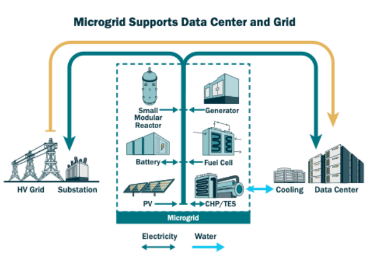
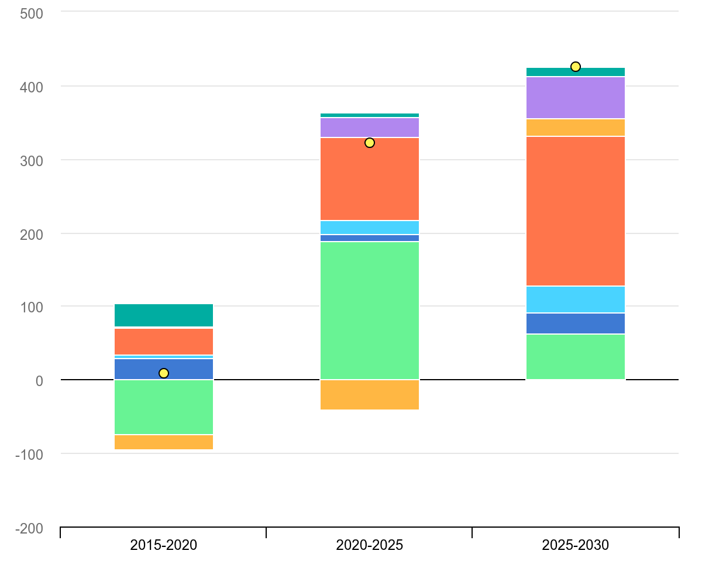
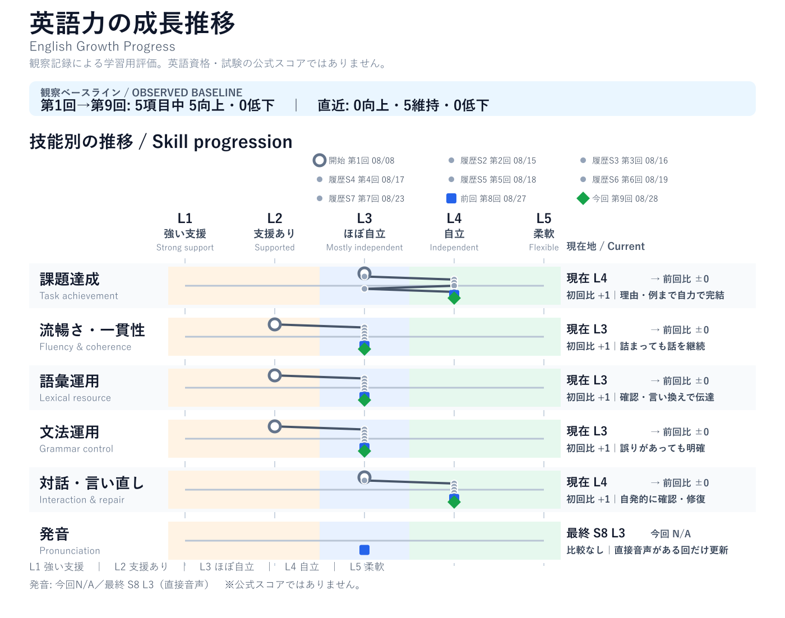
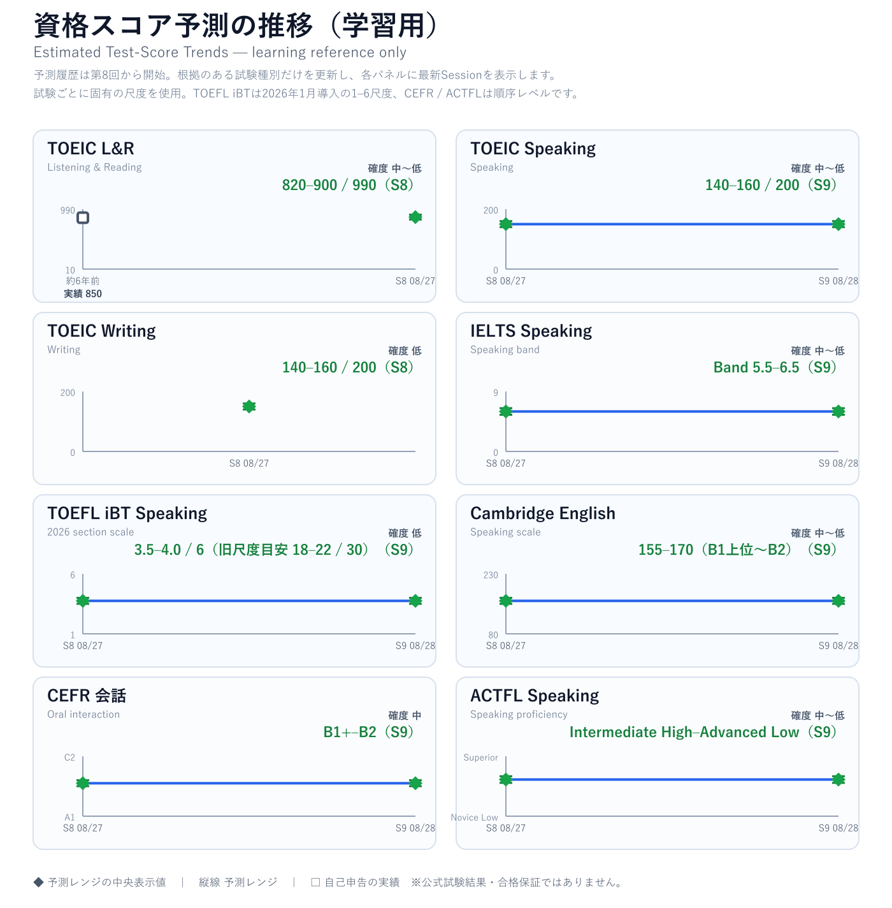

<!-- This file is generated by scripts/build-github-journal.mjs. Do not edit it directly. -->

# Yuki × Chappy English Journal

> 一冊を開き、目次から今日の復習・全セッション・成長・学習バンクへ移動できます。

## 目次

- [今日の5分復習](#journal-five-minute-review)
- [英会話セッション](#journal-sessions)
  - [Session 9 — Godzillaの象徴性と日常からの小さな逃避](#session-2026-08-28-01)
  - [Session 8 — AIデータセンター・電力インフラ・マイクログリッド](#session-2026-08-27-01)
  - [Session 7 — エネルギー戦略・電化・先端エネルギー研究](#session-2026-08-23-01)
  - [Session 6 — ローカルAI・クラウドAIとAI駆動開発](#session-2026-08-19-01)
  - [Session 5 — 面接当日のリセット：気持ちを整える英会話](#session-2026-08-18-01)
  - [Session 4 — AI・データセンターとキャリアを英語で伝える](#session-2026-08-17-01)
  - [Session 3 — 面接準備：強みの言語化と英語面接フレーズ](#session-2026-08-16-01)
  - [Session 2 — GPT-5.6 on Amazon Bedrock：モデル選択とPrompt Caching](#session-2026-08-15-01)
  - [Session 1 — 韓国旅行と英会話リハビリ](#session-2026-08-08-01)
- [英語力の成長・評価](#journal-growth)
- [表現バンク](#journal-expression-bank)
- [語彙バンク](#journal-vocabulary-bank)
- [発音・スピーキングバンク](#journal-speaking-bank)

# 今日の5分復習

「日常の繰り返しから離れたい」を英語で言う

**We want to get away from our usual routine.**

Godzillaが核への恐怖を象徴すると説明する

**Godzilla symbolizes nuclear fear.**

<em>vibe</em> の意味とホテルの例文を思い出す

意味は「雰囲気、感じ」。

**The hotel has a calm, relaxing vibe.**

[目次へ戻る](#journal-contents)

# 英会話セッション / Sessions

## 2026年8月28日（金）— Godzillaの象徴性と日常からの小さな逃避

> **Session 9 / Recorded session window:** Afternoon JST
> **主な話題:** Hotel stay as a break from routine、Godzillaの象徴性、核への恐怖、戦後の記憶、怪獣スペクタクル

> [!NOTE]
> 今回は発音評価用の録音を回収・直接分析していないため、Pronunciation、WPM、1秒超のポーズは評価しない。

### 今日の要点 / Today at a Glance

日常の繰り返しから少し離れるためのホテル滞在という軽い話題から始め、後半はGodzillaを深く議論した。Yukiは、子どもの頃はmonster battlesの面白さに惹かれていた一方、今はGodzillaをnuclear fear、戦争の記憶、戦後日本の背景を含む複雑な象徴としても受け取っていると説明した。

[National WWII Museumの記事](https://www.nationalww2museum.org/war/articles/godzilla-and-world-war-ii-long-live-king-monsters)を使って、1954年のCastle Bravo testとLucky Dragon No. 5の事件、制作陣の戦争経験、初代作品における放射線・空襲・核兵器の寓意を確認した。Godzillaの魅力は、怪獣バトルのspectacleと核・戦争への深いcommentaryが競合するのではなく、両方が重なっている点にある。

### 話題別メモ / Topic Notes

#### 日常から離れるホテル滞在

- Yukiは、毎日の通勤と帰宅の繰り返しから離れ、ホテルでrelaxingな時間を過ごしたいと話した。
- この文脈では、`out of the ordinary`、`a little escape from the daily routine`、`a calm, relaxing vibe`が自然。
- `vibe`は砕けた自然な会話語で、場所・人・出来事が持つ雰囲気を表せる。

#### Godzillaは何を象徴するか

- Yukiは、Godzillaが時代や作品によってnuclear fearやwarを象徴すると説明した。
- 初代Godzillaは、核実験、放射線、戦時の爆撃の記憶と強く結び付いた存在として描かれる。
- 後の作品ではheroicまたはprotectiveな役割も担うが、その変化はGodzillaを単純なheroやvillainにしない。

#### 象徴性とスペクタクル

- 子どもの頃にはmonster battlesが最も大きな魅力だった。
- 今は、歴史的背景やnuclear warへの不安も含めて作品を見られるようになった。
- Yukiはfun, thrilling attractionとdeep attractionの両方を区別して説明できた。

### Yukiの意見・結論 / Yuki’s Takeaways

1. ホテル滞在は、特別なイベントがなくても日常のループから離れるための小さなresetになる。
2. Godzillaは単なるmonsterではなく、nuclear fear、war、postwar Japanを象徴できる複雑な存在である。
3. 長い歴史の中で、monster battlesは多くの人にとって魅力的なentertainmentになった。
4. Yuki自身は、子どもの頃はbattle spectacleを楽しみ、今は歴史と象徴性も含めて魅力を感じている。

### 役立つ英語 / Useful English

#### 🔵 日常から離れたい

**Natural / Conversational**
We want to get away from our usual routine.

**Formal / Professional**
We want a short break from our daily routine.

**Point**
`get away from`は「少し距離を置く」、`usual routine`は日常の繰り返しに自然。

#### 🔵 雰囲気を言う

**Natural / Conversational**
The hotel has a calm, relaxing vibe.

**Formal / Professional**
The hotel has a calm and relaxing atmosphere.

**Point**
`vibe`はカジュアル、`atmosphere`はより中立的。

#### 🔵 Godzillaの象徴性

**Natural / Conversational**
Godzilla symbolizes nuclear fear.

**Formal / Professional**
Godzilla functions as a symbol of nuclear anxiety and postwar memory.

**Point**
`symbolizes`は会話で直接的。`functions as`は分析的。

#### 🔵 子どもの頃と今を比べる

**Natural / Conversational**
When I was a kid, I loved the monster battles, but now I also appreciate the history and the nuclear symbolism.

**Formal / Professional**
My appreciation has broadened from spectacle to historical and symbolic interpretation.

**Point**
`appreciate`には、理解が深まり価値を感じるニュアンスがある。

### 重要な言い換え / Key Refinements

- `I go company every day.` → **I go to work and come home every day. I’m tired of the same routine.**
- `Godzilla is concept of nuclear.` → **Godzilla is a symbol of nuclear fear.**
- `This is one of the attractive point of Godzilla.` → **That’s one of the things that makes Godzilla so appealing.**
- `When I am a kid, monster battle was very attractive for me.` → **When I was a kid, the monster battles were very appealing to me.**

### 発音・スピーキング / Speaking & Pronunciation

**Pronunciation: N/A / 音声未計測。** 文字起こしから発音、WPM、ポーズを推測しない。

練習用チャンク：

- **a calm, relaxing vibe** — `calm`と`relaxing`を少し強くし、`vibe`でゆっくり着地する。
- **Godzilla symbolizes nuclear fear** — `GOD-zilla`、`SYM-bo-lizes`、`NU-clear FEAR`の内容語を強調する。

### 英語力の成長メモ / English Growth & Evaluation

**Overall: L3 / Mostly independent。Interaction & repairではL4相当の行動を維持。**

Yukiは、日常的なホテルの話題を文化・歴史・映画表現の議論へ自然に広げた。`vibe`、`sleek`、`symbol`の意味と使い方を自分から確認し、Godzillaについて子どもの頃の好みと現在の解釈を比較しながら意見を展開できた。

| Metric | Level | Evidence |
|---|---:|---|
| Task achievement | **L4** | symbolismとspectacleの両方について、自分の結論、子どもの頃の経験、現在の解釈をつないで説明した。 |
| Fluency & coherence | **L3** | fillerやrestartはあったが、意味の流れを保って議論を進めた。 |
| Lexical resource | **L3** | `vibe`、`sleek`、`symbol`、`nuclear fear`、`spectacle`を文脈に沿って扱った。 |
| Grammar control | **L3** | 過去形、冠詞、複数形、`go to work`などは支援が必要だったが、意図は明確だった。 |
| Interaction & repair | **L4** | 質問の意図、記事の読み方、話題の継続、訂正の量を自分から調整した。 |
| Pronunciation | **N/A** | 評価録音を直接分析していない。 |

### 資格スコア予測（学習用） / Estimated Test Scores

Session 9の文字起こしから、**Speakingまたはoral interactionを直接扱う6種別**を再評価した。新しい根拠は会話内容・展開・言い直しに限られ、Session 9の直接音声や公式形式の課題はない。そのため数値レンジは無理に動かさず、確度と根拠を更新した。

| テスト種別 | 最新予測レンジ | 更新 | 根拠・確度 |
|---|---:|---|---|
| TOEIC L&R | **820–900 / 990** | Session 8据え置き | **中〜低。** Session 9では時間制限付きListening / Readingを実施していない。 |
| TOEIC Speaking | **140–160 / 200** | **Session 9更新** | **中〜低。** 過去と現在を対比し、理由と例をつないだ。公式形式・直接音声は未測定。 |
| TOEIC Writing | **140–160 / 200** | Session 8据え置き | **低。** Session 9では直接Writing課題を実施していない。 |
| IELTS Speaking | **Band 5.5–6.5** | **Session 9更新** | **中〜低。** 長いturnと抽象的な議論は確認できたが、発音を直接評価していない。 |
| TOEFL iBT Speaking | **3.5–4.0 / 6** | **Session 9更新** | **低。** 自発的な意見展開は確認。統合型課題・時間制限・deliveryは未測定。 |
| Cambridge English Speaking | **155–170（B1上位〜B2）** | **Session 9更新** | **中〜低。** 抽象的な議論と自発修復を確認。公式ペア課題・直接音声は未測定。 |
| CEFR 会話 | **B1+–B2** | **Session 9更新** | **中。** 経験・理由・対比を用いて議論し、意味のずれを自力で修復した。 |
| ACTFL Speaking | **Intermediate High–Advanced Low** | **Session 9更新** | **中〜低。** connected discourseは確認できたが、時制・複数形・構成に不安定さが残る。 |

これは公式スコアへの換算や合格保証ではなく、学習計画用の非公式レンジである。評価観点は[TOEIC L&R](https://www.iibc-global.org/english/toeic/test/lr/guide05/guide05_01/score_descriptor.html)、[TOEIC S&W](https://www.iibc-global.org/english/toeic/test/sw/guide05/guide05_01/score_descriptor.html)、[IELTS Speaking](https://ielts.org/cdn/ielts-guides/ielts-speaking-band-descriptors.pdf)、[TOEFL iBT](https://www.ets.org/toefl/test-takers/ibt/scores/understand-scores.html)、[Cambridge English](https://www.cambridgeenglish.org/exams-and-tests/qualifications/results/)、[CEFR](https://www.coe.int/en/web/common-european-framework-reference-languages/cefr-descriptors)、[ACTFL](https://www.actfl.org/uploads/files/general/Resources-Publications/ACTFL_Proficiency_Guidelines_2024.pdf)を参考にした。

### 学習バンク更新 / Study Banks Update

- [Expression Bank](#journal-expression-bank): 新規3件
- [Vocabulary Bank](#journal-vocabulary-bank): 新規4件
- [Pronunciation & Speaking Bank](#journal-speaking-bank): 練習チャンク2件。発音評価の根拠には使わない。

> [!TIP]
> 次回はGodzillaについて、**main point → reason → example → conclusion**の4段構成で60秒話す。

### 次回 / Next Steps

1. `vibe`を使って、好きなホテル・レストラン・映画の雰囲気を一文で言う。
2. Godzillaについて4段構成で60秒ほど話す。
3. 次回候補：歴史的な出来事が映画・ゲーム・小説のmonsterやheroにどう影響するか。

### Sources / References

- [National WWII Museum — Godzilla and World War II: Long Live the King of Monsters](https://www.nationalww2museum.org/war/articles/godzilla-and-world-war-ii-long-live-king-monsters)

[ページ先頭へ戻る](#journal-contents) · [Session Index](#journal-sessions)

---

[目次へ戻る](#journal-contents)

---

## **｜2026年8月27日（木）AIデータセンター・電力インフラ・マイクログリッド**

Session 8 / Direct reading recording included

## 今日の要点 / Today at a Glance

AIデータセンターの急速な拡大で電力需要が増える一方、送電線・変電所などの大規模な系統増強には長い時間がかかることを、公式記事とIEAの予測グラフを使って議論した。Yukiは、microgridを「データセンターの近くに置く小さな地域電力システム」として理解し、主系統が忙しい時間帯にbatteryやlocal generationで支える仕組みを整理した。

## 話題別メモ / Topic Notes

### 1\. AIデータセンターと電力需要

データセンターはserver、GPU、high-speed networking、cooling、power systemsから成る物理的な施設である。大規模AIは、学習時だけでなく、日々の推論でも多くのGPUと電力を必要とする。従来のsupercomputerが限られた研究用途だったのに対し、現在は多くのクラウドサービスとAI利用を支える多数のデータセンターが急速に増えている。

### 2\. Microgridが担う役割

microgridは、主系統への接続、local generation、battery storage、control softwareを組み合わせるローカル電力システムである。データセンターの早期接続、需要ピーク時の負荷抑制、停電時のcritical load維持に役立つ。ただし、送電線・変電所・発電設備の長期的な増強を置き換えるものではなく、移行期を支える補完策である。

### 3\. Yukiの見解：電化と一次エネルギー

Yukiは、電化が自動的に脱炭素を意味するわけではないと指摘した。fossil fuelsがprimary energy sourcesとして残り、electricity generationでcoalやnatural gasを使う地域では、変換時の熱損失も含めて考える必要がある。nuclear powerはlow-carbonで安定供給に寄与し得るが、安全性・廃棄物・コスト・社会的信頼の課題もあるという立場を示した。

## 役立つ英語 / Useful English

| 目的 | Natural / Conversational | Formal / Professional | ポイント |
| ----- | ----- | ----- | ----- |
| **意見を慎重に伝える** | I’m skeptical about the recent trend toward placing greater emphasis on electricity. | Greater electrification does not automatically reduce emissions when the generation mix remains fossil-fuel intensive. | electricityはprimary energyではなくenergy carrier。環境価値はgeneration mixとend-use efficiencyの両方で考える。 |

### Vocabulary

microgrid /ˈmaɪ.kroʊ.ɡrɪd/ (noun): a small local electricity system that can use the main grid, local generation, batteries, and controls.
primary energy /ˈpraɪ.mer.i ˈen.ɚ.dʒi/ (noun): energy available before conversion, such as coal, natural gas, wind, or nuclear fuel.
energy carrier /ˈen.ɚ.dʒi ˈker.i.ɚ/ (noun): a form that delivers energy, such as electricity or hydrogen.

## 発音・スピーキング / Speaking & Pronunciation

Direct audio evidence: 約59.8秒の英語音読を確認。48kHz monoで、near clippingは確認されず、全文が概ね安定して認識された。話速は約105語/分で、聞き手が追いやすい練習ペースだった。
Pronunciation evaluation: L3 / Mostly independent。全体の明瞭さは良好。次はcontent wordsを強く、function wordsを軽くして、stressとrhythmをさらに明確にする。これは標準化された音素採点ではなく、直接録音の明瞭さ・ペース・音声品質に基づく学習用評価である。
Practice chunks: “TECHnology can make EVeryday LIFE safer and more conVENient.” / “TRUST is just as imPORtant as innoVAtion.”

## Chappy’s Comment

今日の議論で特に良かったのは、記事の要約を受け取るだけでなく、「なぜ今データセンターの電力が問題なのか」「電化は本当に環境に良いのか」と前提まで掘り下げたこと。AI、系統、一次エネルギー、原子力を一つの視点で結び付けられた。次は、結論を最初に一文で置き、reasonとexampleを一つずつ加えると、技術的な意見がさらに説得力を増す。

## 英語力の成長メモ / English Growth Snapshot

Task achievement: L4。データセンター、GPU、supercomputer、microgrid、一次エネルギーをつなげ、自分の意見を理由付きで展開した。
Fluency & coherence: L3。語を探すpauseがあっても、質問で確認しながら論点を維持した。
Lexical resource: L3。microgrid、primary energy、energy carrier、generation mixなどを質問して理解し、議論に使った。
Grammar control: L3。意味は明確に保てた。主語・冠詞・単複を整えると、長い説明がより自然になる。
Interaction & repair: L4。分からない語、記事の難易度、説明の順番を自発的に調整し、意図と異なる理解もその場で修正した。
Pronunciation: L3。直接録音で全体の明瞭さと安定したペースを確認。次はstressとrhythmを重点的に練習する。

## 学習バンク更新 / Study Banks Update

Expression Bank: 3 Bank横断で重複を確認し、“I’m skeptical about the recent trend toward placing greater emphasis on electricity.” を先頭へ追加済み。
Vocabulary Bank: 3 Bank横断で重複を確認し、microgrid / primary energy / energy carrier を先頭へ追加済み。
Pronunciation & Speaking Bank: 直接音声の根拠に基づき、content wordsのstressとfunction wordsのweak formsを練習する2つのchunksを先頭へ追加済み。

## 次回 / Next Steps

60秒で説明する: “Why are AI data centers becoming an energy-infrastructure issue, and what can microgrids do?”
Structure: Main point → reason → example → conclusion。

## Sources / References

[U.S. Department of Energy — “Microgrids, Large Electric Loads & Grid Support”](https://www.energy.gov/oe/articles/microgrids-large-electric-loads-grid-support-how-leverage-microgrids-support-utilities)
[International Energy Agency — “Electricity 2026: Demand”](https://www.iea.org/reports/electricity-2026/demand)

[*図1 / Figure 1: マイクログリッドによるデータセンター支援（U.S. Department of Energy, Office of Electricity 公式記事画像）*](https://www.energy.gov/oe/articles/microgrids-large-electric-loads-grid-support-how-leverage-microgrids-support-utilities)

*利用条件: DOE公式サイトのコンテンツは、別記がない限りパブリックドメインとする[公式再利用方針](https://www.energy.gov/cmei/systems/awardee-communications-support#reposting-and-remixing-content)を参照。新しい学習画面では自作概念図を使用する。*

*図2 / Figure 2: 米国の用途別電力需要増加、2015–2030。出典: [IEA (2026), Electricity 2026 — Demand](https://www.iea.org/reports/electricity-2026/demand), License: [CC BY 4.0](https://creativecommons.org/licenses/by/4.0/)。表示用にトリミングした派生画像。This is a work derived by Yuki × Chappy from IEA material and Yuki × Chappy is solely liable and responsible for this derived work. The derived work is not endorsed by the IEA or its Member countries in any manner.*

[目次へ戻る](#journal-contents)

---

## ｜2026年8月23日（日）エネルギー企業の戦略と先端エネルギー研究

Session 7 / Recorded session window: 06:54–07:34 JST
主な話題: 応募先のエネルギー企業の中期経営方針、電化と発電時CO2、エネルギー安定供給、大学の研究機関での先端エネルギー研究、キャリア動機
評価上の注意: 本レポートは文字起こしを根拠とする。Pronunciation、WPM、1秒超のポーズは直接計測していないため評価しない。共通60秒課題は未実施のため、新しい定量スコアは作成しない。

## 今日の要点 / Today at a Glance

Yukiは、応募先のエネルギー企業で次の選考段階へ進んだことを共有し、面接にも役立つ公開英語記事を音読・議論した。記事の中心である2050年カーボンニュートラル、持続可能な社会、stakeholdersについて、自分の意見を英語で展開した。
電化については、利用時に排出がなくても発電方法によってCO2が生じるため、「電化＝自動的な脱炭素」ではないと指摘した。そのうえで、安定供給と脱炭素を同時に進める必要があるという結論に至った。
後半では、大学の研究機関で取り組んだ先端エネルギー研究を説明した。異なる時間スケールの現象を扱うシミュレーションを実験へ接続し、実験前の設計条件を検討した経験を、エネルギー分野で社会へ貢献したい動機へ結び付けた。

## 話題別メモ / Topic Notes

### **1\. エネルギー企業の方針とstakeholders**

公式のLong-Term Management Vision 2030 / Medium-Term Management Plan 2026を読み、2030年を2050年カーボンニュートラルへ向けた転換点と位置付けていることを確認した。Yukiは、政府が国の目標とエネルギー政策を定めるため、重要なstakeholderだと説明した。一方で、企業、顧客、地域社会、従業員、投資家を含むsociety as a wholeも影響を受けるという広い見方を示した。

### **2\. 電化は自動的な脱炭素ではない**

Yukiの中心的な問いは、電気を使う側がcleanでも、発電過程にCO2が残る場合、electrificationをどこまで推進すべきかという点だった。議論では、電気はenergy carrierであり、環境価値はgeneration mixと効率に左右されると整理した。EVやheat pumpなど適する用途の電化と、電源の脱炭素化、送電網・蓄電・安定供給を同時に進める必要がある。

### **3\. 先端エネルギー研究と複数スケールのシミュレーション**

研究経験の説明では、異なる時間スケールを扱う複数のsimulationを実験へ結び付け、実験前にmaterialやgeometryなどの設計条件を検討した流れを英語で伝えた。技術語が不足した場面でも、particle / fluid / material / shapeなど既知語で意味を維持し、必要な用語を質問して説明を完成させた。

### **4\. エネルギー分野へのキャリア動機**

Yukiは、エネルギーは社会全体を変え得る基盤であり、先端エネルギー技術が実用化されれば世界のエネルギー問題を大きく改善できると考えている。研究は長期的な可能性、応募先企業の事業は現在の安定供給と移行を担う実践領域であり、研究経験と現在のキャリア志向を一つの物語として説明できる。

## 役立つ英語 / Useful English

### **Natural / Conversational と Formal / Professional**

| 目的 | Natural / Conversational | Formal / Professional | ポイント |
| ----- | ----- | ----- | ----- |
| **選考通過** | They told me I had moved on to the next stage. | I was informed that I had progressed to the next stage of the selection process. | move on to the next stage が自然。 |
| **電化への懸念** | Electricity is only as clean as how it’s generated. | The environmental benefit of electrification depends on the power-generation mix. | 利用時だけでなく発電過程も見る。 |
| **研究分野** | My research focused on an advanced energy technology. | I specialized in simulation and experimental design for advanced-energy research. | majorよりresearch focus / specializeが適切。 |
| **実験設計** | I ran simulations to choose the material and geometry. | I used coupled simulations to optimize the design conditions before the experiment. | 技術文脈の形状はgeometry。 |
| **両立** | We need both a stable energy supply and faster decarbonization. | Energy policy must balance security of supply with accelerated decarbonization. | both A and B / balance A with B。 |

## 発音・スピーキング / Speaking & Pronunciation

Pronunciation: N/A / 音声未計測。今回の記録は文字起こしのみを根拠とし、発音・stress・rhythm・linking・WPM・ポーズ時間を推定しない。音読中は遮らず、完了後に内容と再利用価値の高い語句だけを扱った。
会話の途中でYukiが「訂正が多すぎる」と明示したため、意味への反応を先にし、意味が明確な英語は過度に直さない運用ルールへ即座に戻した。これはInteraction & repairの重要な実例でもある。

## 英語力の成長メモ / English Growth Snapshot

Task achievement: L4。電化への疑問から先端エネルギー研究、社会的な動機まで、理由と具体例をつないで説明した。
Fluency & coherence: L3。pauseやrestartがあっても、専門的な説明の意味の流れを維持した。
Lexical resource: L3。advanced-energy research、particle / fluid simulation、material、geometryなどを使い、未知語は質問と既知語で補った。
Grammar control: L3。動詞形・冠詞・語順に誤りがあっても、ほとんどの意味は明確だった。
Interaction & repair: L4。記事の選択、Chromeでの表示、質問の意図、訂正量、レポート開始・停止を自発的に調整した。
Pronunciation: N/A / 音声未計測。

### **良かった点**

* 研究内容を、目的、複数スケールのシミュレーション、実験前の設計という順で詳しく説明できた。
* 電化の利点だけでなく、発電時CO2という前提を問い直し、議論を深めた。
* 過度な訂正に対して明確に希望を伝え、会話の自然さを回復した。

### **次に伸ばす点**

* 専門説明では、Purpose → Method → Result / Impact の3段構成を先に置く。
* energy carrier、generation mix、commercially viableなど、エネルギー議論の核語彙を再利用する。
* 面接では、先端エネルギー研究の長期視点と、現在のエネルギー事業で実現したい価値を一文で接続する。

## 学習バンク更新 / Study Banks Update

Expression Bank: 「Electricity is only as clean as how it’s generated.」を追加。
Vocabulary Bank: electrification を追加し、energy carrier / generation mixとの使い分けを記録。
Pronunciation & Speaking Bank: 該当なし。直接音声を計測しておらず、独自の発音課題を確認できないため追加しない。

## 次回 / Next Steps

* 先端エネルギー研究を60秒で説明する: Purpose → Method → Result / Impact。
* 面接用に「研究経験 → エネルギーへの問題意識 → 応募先企業での実践的貢献」を短い英語でつなぐ。
* 次回の共通課題候補: How should an energy company balance electrification, energy security, and decarbonization?

## Sources / References

* 応募先企業の公開英語資料（組織名とURLは匿名化）
* [METI — Green Growth Strategy Through Achieving Carbon Neutrality in 2050](https://www.meti.go.jp/english/policy/energy_environment/global_warming/ggs2050/index.html)
* 大学研究機関の公開資料（所属名とURLは匿名化）

[目次へ戻る](#journal-contents)

---

## 2026年8月19日（水）— ローカルAI・クラウドAIとAI駆動開発

> **Session 6 / Recorded session window:** 09:02–10:00 JST
> **主な話題:** Local AI / Cloud AI / Hybrid AI、Foundry Local、AI投資支援アプリ、企業向けIoT、AI駆動開発
> **評価上の注意:** 本レポートは文字起こしを根拠とする。Pronunciation、WPM、1秒超のポーズは直接計測していないため評価しない。共通60秒課題は未実施のため、新しい定量スコアは作成しない。

### 今日の要点 / Today at a Glance

Yukiは、ローカルAIとクラウドAIの使い分けについて、個人開発と業務の両面から詳しく議論した。自宅にはLLM実行用に構築した高性能PCがあり、個人データや単純な処理にはローカルAI、複雑なコーディング・高度なreasoning・最新情報の検索にはクラウドAIが適しているという結論に至った。

個人開発では、企業分析、銘柄スクリーニング、ポートフォリオ管理、投資判断支援を扱う投資支援アプリを開発している。Ollamaは通常のチャットには十分だが、LangGraphを使ったagentic workflowでは、入力を通常チャットとエージェントタスクに振り分ける最初のrouting判断が不安定になる場合があると説明した。

業務面では、勤務先のソフトウェア開発部門で、企業向けIoTプラットフォームの開発・テストに関わっていることを共有した。AIの対象をテスト工程だけに限定せず、要件・設計・実装・レビュー・テスト・リリース・保守を含む開発ライフサイクル全体へ広げたいという構想を説明した。組織へ提案する際の最優先の価値は、反復作業の削減と生産性向上による**コスト削減**である。

また、音声会話の実音声から発音を評価し、セッションレポートへ反映できる機能をOpenAI Supportへ要望として送信した。AI-assisted supportからは、現在のVoice Modeには音素精度、stress、intonation、linkingなどを実音声から直接採点する文書化された機能はない、という説明があった。要望は送信済みだが、製品チームによる検討や実装は約束されていない。

### 話題別メモ / Topic Notes

#### 1. Local AI・Cloud AI・Hybrid AI

- Yukiの第一優先は**速度**。
- 自宅の高性能GPU・CPU搭載PCは、個人用途のローカルLLM実行に向いている。
- ローカルAIが向く用途:
  - 個人情報・投資メモ・機密データ
  - 単純なチャット、要約、抽出
  - オフライン処理、低遅延が必要な処理
- クラウドAIが向く用途:
  - 複雑なコーディング
  - 深いreasoningや複数段階の検証
  - 最新情報を使う検索・調査
  - 高性能モデルを必要とするagentic workflow
- 結論は、単純・機密タスクをローカル、難しいタスクをクラウドへ送る**hybrid architecture**。

#### 2. Microsoft Foundry Local

Microsoftの公式記事を使い、Foundry Localの特徴を確認した。

- AIモデルをユーザーのデバイス上で実行できる。
- データをデバイス内へ保ち、オフラインでも利用できる。
- ネットワーク遅延とクラウドのper-token costを抑えられる。
- GPU、NPU、CPUを検出し、利用可能なhardware accelerationを自動選択する。
- ローカル用途向けに最適化されたモデルカタログとOpenAI-compatible APIを提供する。

**Source:** [Microsoft Learn — What is Foundry Local?](https://learn.microsoft.com/en-us/azure/foundry-local/what-is-foundry-local)

#### 3. 投資支援アプリとAgent Routing

Yukiの投資支援アプリは、企業分析、銘柄スクリーニング、ポートフォリオ管理、投資判断支援を扱う。OllamaによるローカルLLMはチャット用途では十分だが、agentic taskか通常チャットかを判断するrouterの精度が安定しない場合がある。

今回整理した改善案:

1. RouterをLangGraphの最初に置く。
2. 出力を `CHAT` / `AGENT` とconfidenceに限定する。
3. 実際に誤分類した入力を保存し、few-shot examplesとevaluation setへ使う。
4. tool use、fresh data、複数action、外部状態の変更が必要ならagent候補とする。
5. confidenceが低い場合は、clarificationまたはcloud modelへrouting判断だけをfallbackする。
6. 数値、価格、財務比率は検証済みデータとdeterministic codeを正本にし、LLMは説明・比較・シナリオ整理を担当する。

#### 4. 企業向けIoT・AI駆動開発

Yukiは勤務先のソフトウェア開発部門で、企業向けIoTプラットフォームの開発・テストに関わっている。AI initiativeはテスト自動化だけでなく、開発工程全体を対象とする。

想定できる支援領域:

- Requirements: 要件の分類、曖昧さ検出、traceability支援
- Design: 設計案の比較、interface・failure modeのレビュー
- Implementation: code generation、review、refactoring、documentation
- Testing: test-case generation、coverage分析、log analysis、defect triage
- Release / Operations: release note、incident summary、knowledge retrieval
- Management: 反復作業時間、lead time、defect数、rework costの可視化

提案時の第一のbusiness valueは**lower cost**。ただし、単なるAI導入数ではなく、削減時間、開発lead time、defect escape、rework、運用工数などで効果を測る必要がある。

#### 5. Trustworthy AI / NIST AI RMF

投資支援アプリの信頼性を考えるため、NISTの英語記事を次の学習ソースとして選んだ。AIのrisk management、testing、monitoring、data qualityを、個人開発と業務の両方へ応用できる。

**Source:** [NIST — AI Risk Management Framework](https://www.nist.gov/itl/ai-risk-management-framework)

### 役立つ英語 / Useful English

#### Natural / Conversational と Formal / Professional

| 目的 | Natural / Conversational | Formal / Professional | ポイント |
|---|---|---|---|
| 具体的に聞く | **Could you explain that more specifically?** | **Could you provide a more concrete example?** | 会話では `specifically` が自然。`concretely` は可能だが、より硬く抽象的に響く場合がある。 |
| PCの説明 | **I built a high-spec PC for running LLMs.** | **I built a high-performance workstation for local LLM inference.** | `high-end PC` も自然。 |
| Hybrid方針 | **For simple tasks, I’ll use local AI. For complex tasks, I’ll use cloud AI.** | **We use a hybrid architecture that routes workloads according to privacy, latency, and model-capability requirements.** | 会話では短い2文が明確。 |
| 業務の説明 | **I’m involved in developing an enterprise IoT platform.** | **I’m involved in the development and system-level testing of an enterprise IoT platform.** | `be involved in` は担当・関与を自然に表す。 |
| AI提案 | **I’m leading an initiative to integrate AI into our software-development process.** | **I’m proposing an organization-wide initiative to integrate AI across the software-development lifecycle.** | 日本語の「テーマ」は、この文脈では `theme` より `initiative` / `project` が自然。 |
| 効果 | **AI can make our work more efficient and effective.** | **The initiative aims to improve operational efficiency and development effectiveness.** | `efficient` は時間・労力、`effective` は成果。 |
| コスト | **Cost reduction is our top priority.** | **Cost reduction is our primary business objective because the department closely manages development expenditure.** | `be conscious of development costs` も自然。 |

#### 今回の重要チャンク

- **My goal is to use AI across the entire development lifecycle—not just testing—to make our work more efficient and effective.**
- **Cost reduction is our top priority because our department is highly conscious of development costs.**
- **Ollama is sufficient for ordinary chat, but it is not yet reliable enough for complex agentic workflows.**
- **The routing works in some cases, but not in others.**
- **All of the above.**
- **Do you know what I’ve been working on recently?**

#### Word choice: team と theme

- **team** /tiːm/: チーム、班
- **theme** /θiːm/: テーマ、主題
- 日本語の「業務テーマ」は、英語では文脈に応じて **initiative**, **project**, **focus**, **topic** が自然。

Practice:

> **Our team is working on an AI initiative for the entire development lifecycle.**

### Yukiの意見・結論 / Yuki’s Takeaways

1. 現状では、YukiにとってクラウドAIが複雑な仕事の第一選択である。
2. ローカルAIは速度、プライバシー、個人用途、単純タスクで価値がある。
3. 高性能PCがあっても、複雑なcoding、reasoning、search、agentic workflowではクラウドAIが優位。
4. 投資支援アプリでは、検証済みデータ・計算とLLMの説明能力を分離する必要がある。
5. 業務のAI initiativeはテストだけでなく、開発ライフサイクル全体を対象とする。
6. 組織への提案では、コスト削減を最初のbusiness caseにする。

### 今回の英会話評価 / English Performance

#### Overall

**L3 / Mostly independent。Interaction & repairではL4相当の行動が明確に見られた。**

Yukiは、local/cloud AI、Ollama、LangGraph、agent routing、投資支援、IoT testing、AI-driven developmentという複雑な技術・業務テーマについて、自分の経験と判断を結び付けて会話を継続した。語を探すpauseやrestartは多かったが、意味がずれたときに自分から止めて説明し直し、会話の方向、訂正量、記事の選び方、レポート要件を明確に調整できた。

| Metric | Level | Evidence |
|---|---:|---|
| Task achievement | **L3** | 結論と理由を伝え、個人開発・業務の例を詳しく説明した。要点の英文化やまとめには支援を利用した。 |
| Fluency & coherence | **L3** | pause、filler、restartがあっても、技術的な説明を中断せず、意味のつながりを保った。 |
| Lexical resource | **L3** | Ollama、LangGraph、agentic task、integration test、system test、development lifecycleなど、必要な技術語彙を使用した。日常的な接続表現やregisterの選択では支援を利用した。 |
| Grammar control | **L3** | 語形、冠詞、前置詞、比較表現に誤りがあっても、ほとんどの場合は意味が明確だった。 |
| Interaction & repair | **L4** | 誤解を即座に修正し、`team/theme`、`reasoning/inference`、訂正量、話題変更、記事・レポート要件を自発的に調整した。 |
| Pronunciation | **N/A** | 信頼できる直接音声の分析・計測がないため評価しない。文字起こしから推定しない。 |

#### Strengths

- 自分の個人開発と実務を、抽象的なAI議論へ具体的に結び付けた。
- 分からない語やニュアンスをその場で確認した。
- 意図と違う返答に対し、会話を止めて適切にrepairできた。
- AI initiativeの目的を、技術だけでなくcost reductionというbusiness valueへ結び付けた。

#### Next Focus

- 最初に一文で結論を置き、その後に理由と具体例を一つずつ加える。
- 技術説明では、`Current state → Problem → Proposed approach → Expected benefit` の4段構成を使う。
- `efficient / efficiency / effective`、`specific / specifically / concrete` の品詞とregisterを使い分ける。
- 次回、AI initiativeについて共通60秒課題を実施し、`main point → reason → example → conclusion` を同条件で記録する。

### 学習バンク更新 / Study Banks Update

#### Expression Bank — 新規追加候補

| Expression | Meaning / Usage / Example | Source |
|---|---|---|
| **My goal is to use AI across the entire development lifecycle—not just testing—to make our work more efficient and effective.** | AI initiativeのscopeと目的を一文で説明する。 | 2026-08-19 |
| **Cost reduction is our top priority because our department is highly conscious of development costs.** | 組織提案のbusiness rationaleを説明する。 | 2026-08-19 |

#### Vocabulary Bank — 新規追加候補

| Word / IPA / POS | Meaning / Collocation / Example | Source |
|---|---|---|
| **initiative** /ɪˈnɪʃ.ə.t̬ɪv/ noun | **Meaning:** 組織的な新しい取り組み。 **Collocation:** launch / lead / propose an initiative. **Example:** I’m leading an initiative to integrate AI into our development process. | 2026-08-19 |
| **specifically** /spəˈsɪf.ɪ.kəl.i/ adverb | **Meaning:** 具体的に、特定して。日常会話では `concretely` より自然な場合が多い。 **Example:** Could you explain that more specifically? | 2026-08-19 |

#### Pronunciation & Speaking Bank — 新規追加候補

| Word / Chunk | Speaking & Focus | Source |
|---|---|---|
| **team /tiːm/ vs theme /θiːm/** | `/t/` と `/θ/` の対比。 **Practice:** Our team is working on an AI theme. ※今回は発音を採点せず、練習チャンクとしてのみ登録する。 | 2026-08-19 |

### 次回 / Next Steps

1. AI initiativeを30秒で説明するprofessional pitchを作る。
2. その後、同じ内容を自然な会話表現へ言い換える。
3. 60秒課題: **How should an enterprise use AI across the development lifecycle while controlling cost and risk?**
4. 投資支援アプリのrouterについて、正分類例と誤分類例を各3件用意する。
5. NIST AI RMFから、investment-support appと企業向けIoTプラットフォームの両方に使えるrisk-control項目を選ぶ。

### Sources / References

- [Microsoft Learn — What is Foundry Local?](https://learn.microsoft.com/en-us/azure/foundry-local/what-is-foundry-local)
- [NIST — AI Risk Management Framework](https://www.nist.gov/itl/ai-risk-management-framework)

### Visual / Figure

*Figure: 個人開発と企業向けIoTの用途に合わせたLocal AI / Cloud AI / Hybrid AIの使い分け。会話内容と上記公式記事を基に作成。*

[目次へ戻る](#journal-contents)

---

## 2026年8月18日（火）面接当日のリセット：気持ちを整える英会話

## 今日の要点 / Today at a Glance

面接当日の朝、英語力向上を主目的にしながら、面接前の緊張を整えるための軽い会話を行った。Bon Odori、音楽、ミステリー小説、Dragon Questを題材に、自分の好みと「なぜリラックスできるか」を英語で説明した。

## 話題別メモ / Topic Notes

・面接後は妻とBon Odoriへ行き、food stallsの食事やfestive, lively atmosphereを楽しむ予定。集中しすぎた頭を、場所・音楽・人の雰囲気で切り替えるという自分の方法を説明した。
・休むときはrock music、ライブ会場のenergy、mystery novels、Dragon Questが好きだと話した。物語の状況が変化していくpage-turnerを「謎を自分で解くより、展開そのものを楽しむ」と説明できた。

## 役立つ英語 / Useful English

・gooey：とろっとして伸びる、濃厚な。例：I love gooey cheese.
・a twisty page-turner：意外な展開が続き、次のページを読みたくなる小説。
・a puzzle-solving mystery：手掛かりを追って謎解きを楽しむタイプのミステリー。

### 英語力評価 / English Performance

良かった点：面接前の気持ちや好みを、自分の理由と結び付けて説明できた。分からない語はそのまま止めずに意味を尋ね、意図が違うときは自分から修正して会話を続けられた。英語を日本語に訳さず理解する感覚を意識できていることも、実用的な聞く・話す力につながる前向きな変化。
次に伸ばす点：リラックス会話では正確さより流れを優先し、まず結論を一文で置く練習を続ける。たとえば「I like it because ...」の後に理由を一つだけ足すと、自然さを保ったまま話を少し長くできる。
評価上の注意：今回は共通60秒課題を行っていないため、新しい定量スコアは作らない。文字起こしだけでは発音を評価しないため、Pronunciation は N/A / 音声未計測 とする。

## 学習バンク更新 / Study Banks Update

Expression Bank：該当なし（自然な会話を優先し、既存表現との重複を増やさない）。
Vocabulary Bank：gooey を追加。新出の作品表現はDaily Noteに記録し、再使用の必要が出た段階で重複なくBank化する。
Pronunciation & Speaking Bank：該当なし（信頼できる音声評価を行えないため、発音項目は追加しない）。

## 次回 / Next Steps

・面接後の感想を、短く「気持ち → 理由 → 印象に残ったこと」の順で英語で話す。
・要復習語 concrete / deliverables を、仕事の例文で自然に1回ずつ使う。

[目次へ戻る](#journal-contents)

---

## 8月 17, 2026｜AI・データセンターとエネルギー企業：英語で伝える技術・キャリア

## 今日の要点 / Today at a Glance

英語力向上を主目的に、IEAの記事を根拠にAIとデータセンターの電力需要を議論し、後半は応募先のエネルギー企業の面接に向けて技術経験・転職理由・国際業務への希望を英語で整理した。面接対策は会話題材として扱い、自分の考えを英語で説明し、分からない語を確認しながら言い直す力を重点的に練習した。

## 話題別メモ / Topic Notes

・IEAの記事では、データセンターの電力使用の中心はサーバー（平均約60%）。冷却の割合は、高効率なハイパースケール施設の約7%から、効率の低い企業内施設の30%超まで幅がある。割合の違いは絶対消費量の小ささを意味しない点も確認した。
・勤務先での企業向けIoT・ソフトウェア品質改善の経験を、応募職種の問い合わせ対応・エラー分析・運用改善と結び付けた。
・複数の外部エンジニアを調整する経験、テスト自動化、差分情報をAIへ渡して成果物を更新する構想を説明した。

### 明日の面接戦略 / Interview Strategy

1\. 最初に直接の適合を示す：システムテスト、エラー分析、運用保守、テスト自動化、ベンダーリード。
2\. 実績は一つの具体例で示す：E2Eテスト自動化を自ら構築し、プロセス改善と追加価値を生んだ。
3\. AI活用は補助的な強みとして話す：家庭用エネルギーマネジメントとの直接一致ではないが、課題発見・技術企画・継続改善の力を示す。
4\. 転職理由は前向きにする：経験と合う技術領域で貢献し、明確なキャリア形成と将来の国際的な仕事への道を求めていると説明する。現職への否定的な表現は避ける。
5\. 国際業務は中長期の希望として尋ねる：まず応募職種で専門性を築いて貢献する姿勢を先に伝える。

### 面接で使う核の英語 / Core Interview English

I coordinate an external engineering team on system-level quality work, and I’m also working to integrate AI into our development process to improve efficiency and quality.
Although this initiative is not directly related to residential energy management, it demonstrates my ability to identify process issues, design a technical solution, and lead continuous improvement.
I’m seeking a role that matches my technical experience and offers clearer career development, including opportunities to work internationally in the longer term.
First, I would like to build my expertise and contribute in this position. In the longer term, would there be opportunities to become involved in global projects or work with overseas teams?

### 英語力評価 / English Performance

良かった点：眠気がある中でも、AI・エネルギー・開発プロセス・キャリアという複雑な内容を、自分の言葉で長く説明できた。語が出ないときに言い換え、確認し、誤解を修正したため、Task achievement と Interaction & repair に明確な強みが見られた。 また、「英語を日本語へ訳さず、英語のまま理解できることが増えた」という自己認識は、今後の流暢さにつながる重要な定性的成長である。
今後伸ばす点：長い説明では語順・主語動詞・単複が不安定になりやすい。main point → reason → example → conclusion の4段構成で話すと、Fluency & coherence と Grammar control が安定する。
評価上の注意：本日は共通60秒課題を実施していないため、新しい定量スコアは作らない。発音は保存された音声を直接評価できないためN/Aとする。

### 要復習語 / Review Priority

concrete：具体的な。Example: I want to deliver concrete results.
tangible：実際に確認・実感できる。Example: The project produced tangible improvements.
deliverables：成果物。Example: AI can update deliverables such as specifications and test cases.
次回は日本語の意味を見ずに説明し、自分の仕事の例文で1回ずつ使う。

## 役立つ英語 / Useful English

auxiliary equipment（補助設備）／comprise（〜から成る）／colocation（共同設置型データセンター）／hyperscale（超大規模）／job posting（求人票）／be assigned to（〜に配属される）／express my wish（希望を伝える）／follow up with me（私に状況共有する）／follow through on a commitment（約束を実行する）

## 次回 / Next Steps

・面接直前は新しい情報を増やしすぎず、強み・転職理由・志望理由・逆質問を60〜90秒で確認する。
・次回の英会話では要復習語3語を自然な文脈で再確認する。
・英語力比較のため、次回は終了前に共通60秒課題を1回だけ行う。
・Source: [IEA — Energy demand from AI](https://www.iea.org/reports/energy-and-ai/energy-demand-from-ai)

[目次へ戻る](#journal-contents)

---

## 8月 16, 2026｜エネルギー企業の面接準備：強みの言語化と英語面接フレーズ

### Today at a Glance

応募先のエネルギー企業における家庭向けエネルギーサービス関連の面接に向け、強み・志望理由・入社1年目の貢献を短く伝える準備をした。

### Interview Preparation

Yukiの一貫した強みは、技術・品質・現場をつなげて実際の改善につなげられること。大学院でのエネルギー研究、IoTシステム、E2E自動テスト基盤、品質・運用改善の経験を、家庭用エネルギーマネジメントへの貢献として説明する。

### Interview Message

「まずは業務と技術を早く理解し、品質・運用改善の経験を生かして、早期に具体的な成果を出したい。」
面接官に覚えてほしい核となるメッセージは、「技術と品質と現場をつなげて改善できる人」。

### Useful English

I’ve prepared a lot for the interview.
I put together an interview-prep document.
In my first year, I’ll focus on adapting quickly while delivering concrete results.
What do you think my chances are of getting an offer from the company?

### Speaking & Pronunciation

英語は十分に伝わり、発音も明瞭。今後は細かな訂正より、短い答えを落ち着いたペースで言い切ることを優先する。

### English Growth Snapshot

これまでの3回の会話を比べると、伝わりやすさ、話題を広げる力、英語で自分の意図を確認・調整する力が伸びている。今回は面接の3つの優先順位と1年目の貢献を、質問を重ねながら自分の言葉で組み立てられた。次は60秒の言い切り、冠詞・前置詞、意味チャンクでの発話を重点にする。

### Next Steps

面接前に「志望理由」「入社1年目の貢献」「応募先企業で実現したいこと」を各60秒程度で声に出して練習する。

[目次へ戻る](#journal-contents)

---

## 8月 15, 2026｜[GPT-5.6 on Amazon Bedrock：モデル選択とPrompt Caching](#session-2026-08-15-01)

### ✨ Today at a Glance

| Focus | Session Snapshot |
| :---: | ----- |
| **Baseball & recovery** | 野球練習、カフェ、昼寝を通じて「良い疲れ」とリラックスした一日を英語で表現。 |
| **AWS / AI** | Amazon Bedrock上のGPT-5.6 Sol・Terra・Lunaとexplicit prompt cachingを公式記事で学習。 |
| **English development** | 技術記事の長文音読に取り組み、会話のflowを守る新しいフィードバック順序を決定。 |

### ⚾ Baseball Practice, Café & Recovery

今日は野球練習に参加し、練習後はかなり疲れたものの「悪い疲れではなく、良い感じの疲労」だった。カフェではegg and bacon toast、cheese and bacon croissant、blend coffeeを楽しみ、帰宅後に昼寝をしてかなり回復した。

Yuki: “Today, I went baseball practices.”
Natural: “I had baseball practice today.” / “I went to baseball practice today.”
Why: practiceはこの文脈では不可算的に使い、go to / have baseball practiceをひとまとまりで覚える。

Yuki: “I get good exhausted.”
Natural: “I was tired in a good way.”
Native-ish: “It was a good kind of tired.” / “I felt pleasantly tired.”
Why: exhaustedは「かなり消耗した」という強い語。心地よい疲労にはtired in a good wayが自然。

Yuki: “I ate breads.”
Natural: “I had some bread.” / “I had a croissant.”
Why: breadは通常不可算名詞。カフェで食べたものを話すときはI had ... が会話的。

Yuki: “I was back home and I took nap.”
Natural: “I got home and took a nap.”
Why: take a napには冠詞aが必要。移動して帰宅したことはgot homeが自然。

### ☁️ AWS / AI Discussion: GPT-5.6 on Amazon Bedrock

AWS公式情報で、OpenAI GPT-5.6 Sol・Terra・LunaがAmazon Bedrockで一般提供されていることを確認した。GA announcement:
7月 13, 2026。3モデルはOpenAI Responses API互換のbedrock-mantle endpointから利用でき、料金はpay-per-token、利用量は既存のAWS commitmentsにも算入される。
[Source: AWS official launch announcement](https://aws.amazon.com/about-aws/whats-new/2026/07/openai-gpt-sol-terra/)

### Explicit prompt caching

explicitは「明確に指定された／意図的に制御された」という意味。developerが再利用するprompt prefixの境界を明示し、system instructions、tool definitions、reference documentsなどの繰り返し部分をcacheできる。
[🔗 AWS公式記事：Introducing explicit prompt caching for OpenAI GPT-5.6 models on Amazon Bedrock](https://aws.amazon.com/blogs/machine-learning/introducing-explicit-prompt-caching-for-openai-gpt-5-6-models-on-amazon-bedrock/)

* Cached input: 通常の入力token料金から90%割引。
* Cache lifetime: 少なくとも30分間再利用可能。
* Main benefits: lower cost、faster processing、predictable agentic workloads。
* Yuki’s takeaway: “I think prompt caching reduces the cost of using AI.”

### Sol / Terra / Luna — workload-based model choice

| Model | Best fit / Yuki’s view |
| :---: | ----- |
| **Sol** | autonomous coding、security research、scientific analysis、deep multi-step reasoning。Yukiの通常用途には強力で高価すぎる可能性がある。 |
| **Terra** | reasoning・performance・costのバランス型。投資支援アプリやbaseball scoring appなど、Yukiの個人開発のmain candidate。 |
| **Luna** | classification・summarization・routingなどのhigh-volume / latency-sensitive tasks向け。複数featureをまたぐcodingでは力不足になりやすい。 |

Key principle: “Pick the cheapest model that reliably solves the workload.”
[🔗 AWS公式記事：Get started with OpenAI GPT-5.6 Sol, Terra, and Luna on Amazon Bedrock](https://aws.amazon.com/blogs/machine-learning/get-started-with-openai-gpt-5-6-sol-terra-and-luna-on-amazon-bedrock/)

### Feature vs Function

投資支援アプリのcockpit、ranking、chatなど、ユーザーから見える製品機能にはfeatureが自然。functionは内部処理・code-level function・technical specification寄り。ただしfunctional specificationsは仕事上自然で正しい表現。
Natural: “The investment-support app has many features.”

### Bedrock vs OpenAI Enterprise — Yuki’s view

Yukiは、Bedrockのtoken-based billing、centralized management、AWS governance、cost transparencyがteam利用に向いていると感じた。これはYukiの実務感覚に基づく比較であり、サービス全体の一般的な優劣ではない。
Natural: “My company is on the OpenAI Enterprise plan.”
Natural: “My company pays per token on Bedrock, which makes cost sharing easier for us.”

### 💬 English in Context

Yuki: “You find talking topic today.”
Natural: “Can you choose a topic for us today?”
Native-ish: “Why don’t you pick a topic for us today?”

Yuki: “Which news is better to talk?”
Natural: “Which article would be better to talk about?”
Native-ish: “Which article do you think would be better for our discussion?”

Yuki: “How do you think about it?”
Natural: “What do you think about it?”

Yuki: “I do individual development at my home.”
Natural: “I do personal development projects at home.”
Native-ish: “I work on my own software projects at home.”

Yuki: “The app is very matured already.”
Natural: “The app is already quite mature.”

Yuki: “The functions is very complex.”
Natural: “The features are quite complex.” / “The application has become pretty complex.”

Natural tech summary: “When the coding spans multiple features, Luna starts to feel limited.”

### 📚 Vocabulary in Context

* explicit — 明示的な。clearly defined / intentionally specified。
* autonomous — 自律的な。An autonomous agent can plan and act within set limits.
* inference — AI modelが入力から出力を生成する処理。
* endpoint — APIの接続先。
* scaling — 利用増加に合わせてcapacityを拡張すること。
* cadence — pace / rhythm。独自の進化・リリース周期。
* durable capability tiers — 長期的に維持される能力階層。
* latency-sensitive — 遅延の小ささが重要な。

### 🗣️ Pronunciation, Reading & Speaking

* autonomous → au-TON-o-mous
* inference → IN-fer-ence
* endpoint → END-point
* migrate → MI-grate
* summarization → summari-ZA-tion
* classification → class-i-fi-CA-tion

今日の長文音読は意味が明確に伝わり、前回よりrhythmが改善。今後はindividual soundsよりchunking / stress / rhythmを優先する。
Chunking: “When the coding / spans multiple features / Luna starts to feel limited.”

### 🎯 English Development & Conversation Rule

Yukiはtechnical articleを英語で長く読み、未知語も説明後にcontextから理解できた。話す途中で単語を探すとsentence structureが崩れることがあるため、短い意味チャンクで組み立てる。

* Conversation: Answer / Opinion first → quick English feedback after.
* Long corrections: session reportへまとめ、会話のflowを優先。
* Reading aloud: “Mm-hmm”, “Yeah”, “Right”程度の相槌のみ。Yukiがfinished / doneと言った後にcontent・pronunciation・vocabulary・correctionsをまとめる。
* Japanese support: 難しい英語・技術説明には使用。日本語そのものの添削は不要。

### 🖼️ References

今回は公式記事の図表・画面内容を文章とリンクで参照し、技術情報の正確性を優先した。

### ➡️ Next

TerraをBedrockで試す、Claudeとのsame-prompt comparison、prompt cachingのcost estimate、投資支援アプリ向けmodel routingを検討。英語では今日の記事の1分要約、Sol / Terra / Lunaの説明、feature vs functionの実践を行う。

────────────────────

[目次へ戻る](#journal-contents)

---

## 2026-08-08｜[韓国旅行と英会話リハビリ：伝わる英語から自然な英語へ](#session-2026-08-08-01)

### ✨ Today at a Glance

* Korea trip: 仁川・ソウル・明洞を訪れ、ブラックジャックでは約20万ウォン勝利。
* First anniversary: 妻へ和紙製の青いバラをプレゼント。
* Recovery & English: マッサージで整えながら、自然な英語・語彙・発音を復習。

### 🇰🇷 Korea Trip & First Anniversary

妻と韓国を旅行し、仁川・ソウル・明洞を訪問。初日のカジノではブラックジャックで約20万ウォン勝った。
明洞では服やコスメを買い、勝ったお金の一部で妻へのプレゼントも購入。明洞は大阪の難波に似た大きな shopping district という話になった。
8月8日は結婚1周年。和紙で作られた青いバラを妻へプレゼントした。
妻はその時あまり体調が良くなかったが、とても驚き、喜んでくれた。

### 💬 English in Context

Yuki: “I’m want to talking about my travel.”
Natural: “I want to talk about my trip.”
Native-ish: “I want to tell you about my trip.”
Why: want to の後は動詞原形。具体的な一回の旅行なら travel より trip が自然。

Yuki: “I went casino first day.”
Natural: “I went to a casino on the first day.”
Native-ish: “We hit the casino on our first day.”
Why: go to \+ 場所。casino は可算名詞なので a casino。on our first day をチャンクで覚える。

Yuki: “My wife was not healthy that time.”
Natural: “My wife wasn’t feeling well at the time.”
Native-ish: “She wasn’t feeling great at the time.”
Why: 一時的な体調不良には not healthy より wasn’t feeling well が自然。

Yuki: “She was very surprised and very pleased.”
Natural: “She was really surprised, and she loved it.”
Native-ish: “She was so surprised — she absolutely loved it.”
Why: pleased も正しいが、プレゼントへの反応なら loved it が会話的。

Yuki: “I bought something for my wife for present.”
Natural: “I bought my wife a gift.”
Native-ish: “I picked up a little gift for my wife.”
Why: buy \+ 人 \+ a gift が簡潔で自然。

Yuki: “The money is I won in casino.”
Natural: “I used the money I won at the casino to buy her a gift.”
Native-ish: “I used some of my casino winnings to get her a gift.”
Why: winnings はカジノなどで得た「勝ち金」。

Yuki: “The Myeong-dong is very big shopping district.”
Natural: “Myeong-dong is a huge shopping district.”
Native-ish: “Myeong-dong is this huge shopping district, kind of like Namba in Osaka.”
Why: Myeong-dong に通常 the は不要。huge は会話で自然な強調。

### 💆 Recovery after the Trip

帰国翌日はかなり疲れており、全身マッサージとヘッドマッサージを受けてリフレッシュした。

Yuki: “I have gone to the massage today.”
Natural: “I got a massage today.”
Native-ish: “I treated myself to a massage today.”
Why: 終わった出来事なので単純過去。get a massage が日常会話で使いやすい。

Yuki: “I’ve got massage the whole body.”
Natural: “I got a full-body massage.”
Native-ish: “I got a full-body massage and a head massage.”
Why: full-body massage をひとつのチャンクとして覚える。

Yuki: “I was back to Japan yesterday.”
Natural: “I got back to Japan yesterday.”
Native-ish: “I just got back to Japan yesterday.”
Why: 移動して戻ったことは got back / came back が自然。

Yuki: “Today is very satisfying.”
Natural: “Today was really relaxing.” / “The massage was exactly what I needed.”
Native-ish: “That massage was exactly what I needed after the trip.”
Why: 疲労回復なら satisfying より relaxing / exactly what I needed が自然。

### 🎯 English Development

意味を伝える力は十分高く、コミュニケーションは成立している。今後は語順・冠詞・時制に加え、一語ずつ丁寧に発音するより短い意味チャンクで話すこと、機能語を弱くして前後につなげることを重点にする。会話中は細かい修正で流れを止めず、重要なフィードバックを後で整理する。

Yuki: “What point I should fix it or improve it?”
Natural: “What should I work on to improve my English?”
Native-ish: “What should I focus on if I want to sound more natural?”
Why: 改善点には work on / focus on が自然。

### 📚 Vocabulary in Context

* street food stall — 屋台。street food と一緒に使うと「屋台・露店」の意味が明確。
* shopping district — 商業地区／繁華街。Myeong-dong is a huge shopping district.
* mall / shopping mall — 大型商業施設。district は地域、mall は施設そのもの。
* full-body massage — 全身マッサージ。ひとかたまりの表現として覚える。
* winnings — 賭け・ゲームなどで得た勝ち金。casino winnings の組み合わせが自然。
*

### 🗣️ Pronunciation & Speaking in Context

* “I got a full-body massage.” → GOT / FULL-body / MASSAGE を目立たせ、a は弱く短くする。
* “I got back to Japan yesterday.” → got‿BACK tə jaPAN YESterday。to は弱形 /tə/、got back はつなげる。
* 単語を一語ずつ同じ強さで読むのではなく、content words に stress を置き、機能語を弱くする。

### 🖼️ Visuals / References

明洞の街並み、ブラックジャックなど、その日のトピック理解に役立つ画像は今後も関連トピックの近くに配置する。ニュース・技術トピックでは一次情報・公式URLを優先する。

### ➡️ Next

韓国旅行をより自然な英語で言い直す練習。語順・冠詞・時制を会話の流れを保ちながら改善。チャンク・弱形・linking を使った発音練習。最新AI・クラウド・ソフトウェアニュースもチャッピー側から持ち込んで議論する。

────────────────────

[目次へ戻る](#journal-contents)

# 英語力の成長・評価 / Growth & Evaluation

> これは会話記録に根拠を置く学習用の評価です。公式試験の結果やスコア保証ではありません。

## できるようになったこと

**最新の会話評価： [Session 9（2026年8月28日）](#session-2026-08-28-01)**

- 旅行など身近な話題から、AI・エネルギー・文化のような抽象的なテーマまで、意見と理由をつないで話せる。
- 分からない語や質問の意図を確認し、誤解を自分で修復できる。
- 子どもの頃と現在の見方のように、過去と現在を対比して一つの話として説明できる。

## Current Snapshot

| 評価観点 | 現在 | 会話で確認できたこと |
|---|---:|---|
| **Task achievement** | **L4 / Independent** | 結論・理由・例をつないで、自分の考えを完結できる。 |
| **Fluency & coherence** | **L3 / Mostly independent** | 言い直しがあっても、話の軸を保って続けられる。 |
| **Lexical resource** | **L3 / Mostly independent** | 関心分野の語彙を使い、確認や言い換えで意図を伝えられる。 |
| **Grammar control** | **L3 / Mostly independent** | 意味は明確。時制・語順・複数形の安定が次の伸びしろ。 |
| **Interaction & repair** | **L4 / Independent** | 語義や質問の意図を自分から確認し、会話を前へ進められる。 |
| **Pronunciation** | **N/A / Session 9未測定** | 最後の直接音声評価はSession 8のL3。 |

## 発音の測定状況

Session 9は直接音声を評価していません。最後に直接確認したのは[Session 8](#session-2026-08-27-01)で、全体の明瞭さは **L3 / Mostly independent** でした。未測定を能力低下として扱わず、新しい直接録音がある回だけ推移を更新します。

## 成長グラフ

Session 1から9までの6指標を時系列で表示しています。Pronunciationは、直接音声の根拠があるSession 8だけを測定値として扱います。画像をタップすると原寸で確認できます。

## 次に伸ばすこと

1. 60秒回答を `main point → reason → example → conclusion` で安定して完結する。
2. 長い発話では、過去時制・語順・複数形を一度だけ意識して整える。
3. 直接録音がある回だけ、強勢・リズム・つながりを測定し、発音の変化を比較する。

## 評価セッションを開く

各リンク先には、その回の評価根拠と次の練習があります。

- [Session 9 — Godzillaの象徴性と日常からの小さな逃避](#session-2026-08-28-01) — 会話評価：L4 / L3 / L3 / L3 / L4、発音は未測定。
- [Session 8 — AIデータセンター・電力インフラ・マイクログリッド](#session-2026-08-27-01) — 初めて直接録音を確認し、発音の明瞭さをL3として記録。
- [Session 7 — エネルギー戦略・電化・先端エネルギー研究](#session-2026-08-23-01) — 専門テーマを自分の経験と社会的な意味につないだ。
- [Session 6 — ローカルAI・クラウドAIとAI駆動開発](#session-2026-08-19-01) — 対話・言い直しではL4相当の行動を確認。
- [Session 5 — 面接当日のリセット：気持ちを整える英会話](#session-2026-08-18-01) — リラックスした会話でも好みと理由を説明した。
- [Session 4 — AI・データセンターとキャリアを英語で伝える](#session-2026-08-17-01) — 技術経験とキャリアの方向性を一つの説明にした。
- [Session 3 — 面接準備：強みの言語化と英語面接フレーズ](#session-2026-08-16-01) — 複雑な面接テーマでTask achievementとInteractionをL4にした。
- [Session 2 — GPT-5.6 on Amazon Bedrock：モデル選択とPrompt Caching](#session-2026-08-15-01) — 技術トピックを文脈の中で扱えるようになった。
- [Session 1 — 韓国旅行と英会話リハビリ](#session-2026-08-08-01) — 自然な語順とチャンクを使う学習の出発点。

## 資格スコアの学習用目安

| 試験・尺度 | 学習用レンジ | 最後に根拠を更新した回 |
|---|---:|---:|
| TOEIC L&R | **820–900 / 990** | Session 8 |
| TOEIC Speaking | **140–160 / 200** | Session 9 |
| TOEIC Writing | **140–160 / 200** | Session 8 |
| IELTS Speaking | **Band 5.5–6.5** | Session 9 |
| TOEFL iBT Speaking | **3.5–4.0 / 6（旧尺度目安 18–22 / 30）** | Session 9 |
| Cambridge English | **155–170（B1上位〜B2）** | Session 9 |
| CEFR 会話 | **B1+–B2** | Session 9 |
| ACTFL Speaking | **Intermediate High–Advanced Low** | Session 9 |

試験ごとに異なる尺度を分離して表示しています。予測履歴はSession 8から開始し、該当する根拠がない試験はSession 9で更新していません。画像をタップすると原寸で確認できます。

いずれも公式形式の試験結果ではなく、会話記録に基づく学習計画用のレンジです。根拠は[Session 9の評価](#session-2026-08-28-01)で確認できます。

## 評価の読み方

L1からL5は、**Strong support → Supported → Mostly independent → Independent → Flexible** の順です。レベルを上げるのは、発言例または同じ条件で測った数値があるときだけです。録音のない回は、発音・話速・ポーズを推測せず **N/A** とします。

[目次へ戻る](#journal-contents)

# 表現バンク / Expression Bank

## 2026年8月28日

| Expression | Meaning / Usage / Example | Source |
|---|---|---|
| **We want to get away from our usual routine.** | 日常の繰り返しから少し離れたいときに使う。 | [Session 9](#session-2026-08-28-01) |
| **Godzilla symbolizes nuclear fear.** | 作品や人物が何を象徴するかを直接説明する。 | [Session 9](#session-2026-08-28-01) |
| **That’s one of the things that makes Godzilla so appealing.** | 魅力の理由を自然な会話表現で説明する。 | [Session 9](#session-2026-08-28-01) |

## 2026年8月19日

| Expression | Meaning / Usage / Example | Source |
|---|---|---|
| **My goal is to use AI across the entire development lifecycle—not just testing—to make our work more efficient and effective.** | AI initiativeの範囲と目的を一文で説明する。 | [Session 6](#session-2026-08-19-01) |
| **Cost reduction is our top priority because our department is highly conscious of development costs.** | 組織提案のbusiness rationaleを説明する。 | [Session 6](#session-2026-08-19-01) |

[目次へ戻る](#journal-contents)

# 語彙バンク / Vocabulary Bank

## 2026年8月28日

| Word / IPA / POS | Meaning / Collocation / Example | Source |
|---|---|---|
| **vibe** /vaɪb/ noun | **意味:** 雰囲気、感じ。**Plain English:** the feeling or atmosphere of a place or situation. **Collocation:** a calm / friendly / modern vibe. **Example:** The hotel has a calm, relaxing vibe. | [Session 9](#session-2026-08-28-01) |
| **sleek** /sliːk/ adjective | **意味:** すっきりして洗練された。**Plain English:** smooth, stylish, and modern-looking. **Collocation:** sleek design / sleek hotel. **Example:** Our hotel has a sleek, modern design. | [Session 9](#session-2026-08-28-01) |
| **symbolize** /ˈsɪm.bə.laɪz/ verb | **意味:** 象徴する。**Plain English:** to represent a deeper idea. **Collocation:** symbolize fear / hope / war. **Example:** Godzilla symbolizes nuclear fear. | [Session 9](#session-2026-08-28-01) |
| **spectacle** /ˈspek.tə.kəl/ noun | **意味:** 壮大で印象的な見せ場。**Plain English:** an impressive visual event or display. **Collocation:** visual spectacle / thrilling spectacle. **Example:** The monster battles create an exciting spectacle. | [Session 9](#session-2026-08-28-01) |

## 2026年8月19日

| Word / IPA / POS | Meaning / Collocation / Example | Source |
|---|---|---|
| **initiative** /ɪˈnɪʃ.ə.t̬ɪv/ noun | **意味:** 組織的な新しい取り組み。**Collocation:** launch / lead / propose an initiative. **Example:** I’m leading an initiative to integrate AI into our development process. | [Session 6](#session-2026-08-19-01) |
| **specifically** /spəˈsɪf.ɪ.kəl.i/ adverb | **意味:** 具体的に、特定して。日常会話では`concretely`より自然な場合が多い。**Example:** Could you explain that more specifically? | [Session 6](#session-2026-08-19-01) |

[目次へ戻る](#journal-contents)

# 発音・スピーキングバンク / Pronunciation & Speaking Bank

## 2026年8月28日

| Word / Chunk | Speaking / Focus / Practice | Source |
|---|---|---|
| **a calm, relaxing vibe** | `calm`と`relaxing`を少し強くし、`vibe`でゆっくり着地する。録音評価ではなく練習用。 | [Session 9](#session-2026-08-28-01) |
| **Godzilla symbolizes nuclear fear.** | `GOD-zilla`、`SYM-bo-lizes`、`NU-clear FEAR`の内容語を意識する。録音評価ではなく練習用。 | [Session 9](#session-2026-08-28-01) |

## 2026年8月19日

| Word / Chunk | Speaking / Focus / Practice | Source |
|---|---|---|
| **team /tiːm/ vs theme /θiːm/** | `/t/`と`/θ/`の対比。**Practice:** Our team is working on an AI theme. 録音評価ではなく練習用。 | [Session 6](#session-2026-08-19-01) |

[目次へ戻る](#journal-contents)
